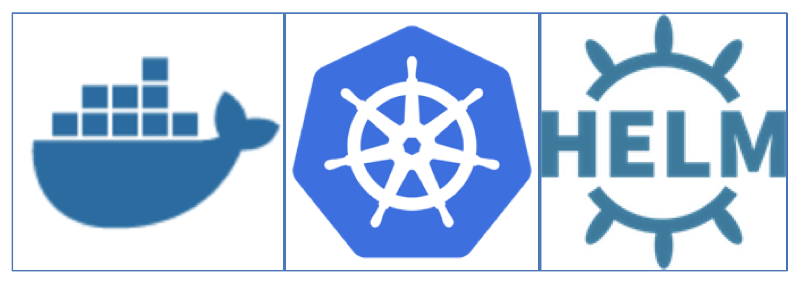
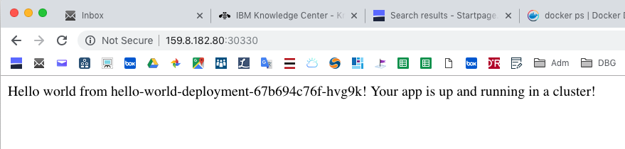
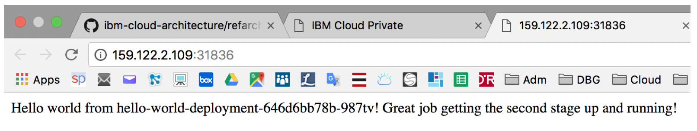
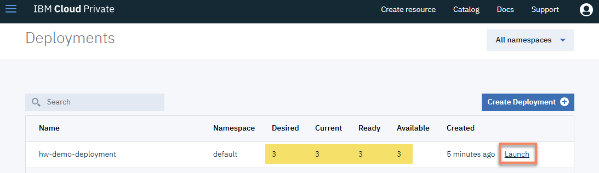
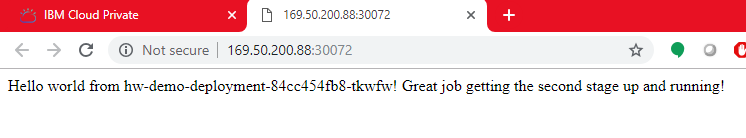
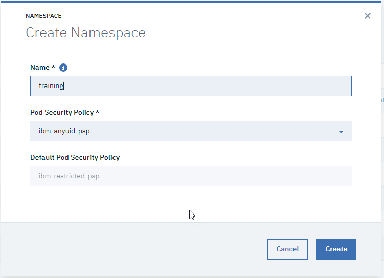

# IBM Cloud Container Workshop


---


# Docker, Kubernetes and Helm Lab

---

This lab is compatible with ICP version 3.1.2




# IBM Cloud Private Overview

**IBM Cloud Private** is a private cloud platform for developing and running workloads locally. It is an integrated environment that enables you to design, develop, deploy and manage on-premises, containerized cloud applications behind your firewall. It includes the container orchestrator Kubernetes, a private image repository, a management console and monitoring frameworks.

### What is a private Cloud ?

 Private cloud is a cloud-computing model run solely for one organization. It can be managed internally or by third party, and can be hosted behind the company firewall or externally. Private cloud offers the benefits of a public cloud, including rapid deployment and scalability plus ease of use and elasticity, but also provides greater control, increased performance, predictable costs, tighter security and flexible management options. Customize it to your unique needs and security requirements.

### Terminology

- **master node** :  
  - controls and manages the cluster
  - **Kubectl**:  command line client
  - REST API:  used for communicating with the workers
  - Scheduling and replication logic
  - Generally 3 or more master nodes for resiliency
- **worker node**
  - is a worker machine in Kubernetes, previously known as a minion. A node may be a **VM** or **physical machine**, depending on the cluster. Each node has the services necessary to run pods and is managed by the master components.
  - **Kubelet**  agent that accepts commands from the master
  - **Kubeproxy**: network proxy service on a node level, responsible for routing activities for inbound or ingress traffic
  - Docker host
- **Containers**: Units of packaging
- **Pods**:
  - A collection of containers that run on a worker node
  - A pod can contain more than one service
  - Each pod has it’s own IP
  - A pod shares a PID namespace, network, and hostname
- **Replication Controller**:
  - Ensures availability and scalability
  - Responsible for maintaining as many pods as requested by the user
  - Uses a template that describes specifically what each pod should contain
- **Labels**:
  - Metadata assigned to K8 resources – such as pods, services
  - Key-Value pairs for identification
  - Critical to K8s as it relies on querying the cluster for resources that have certain labels
- **Services:**
  - Collection of pods exposed as an endpoint
  - Information stored in the K8 cluster state and networking info propagated to all worker nodes
- **Secrets**:
  - Sensitive information that containers need to read or consume
  - Are special volumes mounted automatically so that the containers can read its contents
  - Each entry has it’s own path

### Architecture

See below a global picture showing ICP architecture and most common components.


This lab is going to focus on "Docker / Kubernetes / Helm" which are the main foundation of IBM Cloud Private. 

In this lab, all nodes will be part of a single VM.

## TASK 1 : Check your ICP installation

Using Terraform ( see [https://developer.ibm.com/recipes/tutorials/infrastructure-automation-with-terraform-on-ibm-cloud-iaas/](https://developer.ibm.com/recipes/tutorials/infrastructure-automation-with-terraform-on-ibm-cloud-iaas/) ), we instantiated for you a **virtual server** (16CPU - 32GB RAM - 400GB Disk - 1GB Network speed - Ubuntu 16.04.5 LTS) on IBM Cloud infrastructure (IaaS).

We already have installed **ICP 3.1.2** on it. If you want to have more information on the ICP installation, have a look at : [https://github.com/phthom/icp31/blob/master/1-Installation.md](https://github.com/phthom/icp31/blob/master/1-Installation.md)

You will need **ssh** (or **putty**  ( https://www.putty.org/ )) to access this VM using the **IP address and the root password** the instructors gave you.

From your web browser, go the following address where *ipaddress* is the IP your instructor gave you :

`https://ipaddress:8443`  

**Userid** : admin

**Password** : admin1!


You should receive the **Welcome Page**:


Click on the **Catalog** menu (top right) to look at the list of applications already installed:


The **Catalog** shows Charts that you can visit (it could take au few seconds to refresh the first time)

You can look at the (helm) catalog and visit some entries (but don't create any application at the moment).

### Kubernetes command line tool : KUBECTL

We now need to configure kubectl to get access to the cluster. An alternative method can be used (see Appendix A : How to get connected to the cluster) if you are interested.

On the provided virtual server, we are using a **script** created for you to help to connect to the cluster

Run : 

`cat ~/connect2icp.sh`

and look at the following code :

```console
CLUSTERNAME=mycluster
ACCESS_IP=`curl ifconfig.co`
USERNAME=admin
PASSWD=admin1!

token=$(curl -s -k -H "Content-Type: application/x-www-form-urlencoded;charset=UTF-8" -d "grant_type=password&username=$USERNAME&password=$PASSWD&scope=openid" https://$ACCESS_IP:8443/idprovider/v1/auth/identitytoken --insecure | jq .id_token | awk  -F '"' '{print $2}')

kubectl config set-cluster $CLUSTERNAME.icp --server=https://$ACCESS_IP:8001 --insecure-skip-tls-verify=true
kubectl config set-context $CLUSTERNAME.icp-context --cluster=$CLUSTERNAME.icp
kubectl config set-credentials admin --token=$token
kubectl config set-context $CLUSTERNAME.icp-context --user=admin --namespace=default
kubectl config use-context $CLUSTERNAME.icp-context
```

> These lines in that script are getting a token automatically for you. But every 12 hours, the token expires and you will need to type that script (connect2icp.sh) again. 

Then execute that shell program :

`~/connect2icp.sh`

Results :

```console
# ~/connect2icp.sh
Cluster "cluster.local" set.
Context "cluster.local-context" modified.
User "admin" set.
Context "cluster.local-context" modified.
Switched to context "cluster.local-context".
```

As a result, you will see that you are now **connected** for **12 hours** to the cluster (with only one node):

`kubectl version --short`

Results :

```console
# kubectl version --short
Client Version: v1.12.3
Server Version: v1.12.3+icp
```

Try this command to show all the worker nodes :

`kubectl get nodes`

Results :

```console
# kubectl get nodes
NAME            STATUS    ROLES     AGE       VERSION
169.50.200.70   Ready     etcd,management,master,proxy,worker   35m       v1.12.3+icp
```

> After a long period of inactivity, if you see some connection error when typing a kubectl command then re-execute the `~/connect2icp.sh` command.

To get help from the kubectl, just type this command:

`kubectl`

### ICP Command line tool : cloudctl

This command can be used to configure and manage IBM Cloud Private. We have also installed the **cloudctl** command on the virtual server you will use.

If you need to install cloudctl, type the following curl command : (don't forget to change the ipaddress):

`curl -kLo cloudctl-linux-amd64-3.1.2-1203 https://ipaddress:8443/api/cli/cloudctl-linux-amd64`

Results:

```console 
curl -kLo cloudctl-linux-amd64-3.1.0-715 https://169.50.200.70:8443/api/cli/cloudctl-linux-amd64
  % Total    % Received % Xferd  Average Speed   Time    Time     Time  Current
                                 Dload  Upload   Total   Spent    Left  Speed
100 13.9M  100 13.9M    0     0  38.4M      0 --:--:-- --:--:-- --:--:-- 38.4M

```

Now execute the following commands to change cloudctl to executable and to move that CLI to the right directory :

```
chmod 755 /root/cloudctl-linux-amd64-3.1.2-1203
mv /root/cloudctl-linux-amd64-3.1.2-1203 /usr/local/bin/cloudctl
```

Execute the **cloudctl** command for the first time 

`cloudctl`

Results:

```console 
# cloudctl
NAME:
   cloudctl - A command line tool to interact with IBM Cloud Private

USAGE:
[environment variables] cloudctl [global options] command [arguments...] [command options]

VERSION:
   3.1.0-715+e4d4ee1d28cc2a588dabc0f54067841ad6c36ec9

COMMANDS:
   api       View the API endpoint and API version for the service.
   catalog   Manage catalog
   cm        Manage cluster
   config    Write default values to the config
   iam       Manage identities and access to resources
   login     Log user in.
   logout    Log user out.
   plugin    Manage plugins
   pm        Manage passwords
   target    Set or view the targeted namespace
   tokens    Display the oauth tokens for the current session. Run cloudctl login to retrieve the tokens.
   version   Check cli and api version compatibility
   help      
   
Enter 'cloudctl help [command]' for more information about a command.

ENVIRONMENT VARIABLES:
   CLOUDCTL_COLOR=false                     Do not colorize output
   CLOUDCTL_HOME=path/to/dir                Path to config directory
   CLOUDCTL_TRACE=true                      Print API request diagnostics to stdout
   CLOUDCTL_TRACE=path/to/trace.log         Append API request diagnostics to a log file

GLOBAL OPTIONS:
   --help, -h                         Show help

```


Before using the **cloudctl** with the master, you must login to the master:

`cloudctl login -a https://mycluster.icp:8443 --skip-ssl-validation`

> For the login : admin/admin1!

```console
# cloudctl login -a https://mycluster.icp:8443 --skip-ssl-validation

Username> admin

Password> 
Authenticating...
OK

Select an account:
1. mycluster Account (id-mycluster-account)
Enter a number> 1
Targeted account mycluster Account (id-mycluster-account)

Select a namespace:
1. cert-manager
2. default
3. istio-system
4. kube-public
5. kube-system
6. platform
7. services
Enter a number> 2
Targeted namespace default

Configuring kubectl ...
Property "clusters.mycluster" unset.
Property "users.mycluster-user" unset.
Property "contexts.mycluster-context" unset.
Cluster "mycluster" set.
User "mycluster-user" set.
Context "mycluster-context" created.
Switched to context "mycluster-context".
OK

Configuring helm: /root/.helm
OK

```

With that **cloudctl cm** CLI, you can manage the infrastructure part of the cluster like adding new worker nodes (machine-type-add, worker-add) and so on.

Then you can type some commands concerning your cluster:

`cloudctl cm masters mycluster`

Results

```console
# cloudctl cm masters mycluster
ID             Private IP      Machine Type   State   
mycluster-m1   169.50.200.70   -              deployed 
```

Among all sub-commands in **cloudctl**, there are some commands to manage the infrastructure components like :

- cluster
- workers (adding, removing ...)
- registry (docker image management )
- helm repositories

# Task 1 : Deploying Apps on ICP with Kubernetes

### 1. Check kubectl 

Test your connectivity to the cluster with this command:

 `kubectl get nodes`

If you get an **error**, execute the following script that we created in the installation lab :

`~/connect2icp.sh`


### 2. Download a GIT repo

Download the samples using Git :

`cd`

`git clone https://github.com/IBM/container-service-getting-started-wt.git`
​	
Results:

```
# git clone https://github.com/IBM/container-service-getting-s
Cloning into 'container-service-getting-started-wt'...
remote: Enumerating objects: 8, done.
remote: Counting objects: 100% (8/8), done.
remote: Compressing objects: 100% (8/8), done.
remote: Total 880 (delta 1), reused 2 (delta 0), pack-reused 872
Receiving objects: 100% (880/880), 2.40 MiB | 5.19 MiB/s, done.
Resolving deltas: 100% (445/445), done.
```


### 4. Build a Docker image 

Build the image locally and tag it with the name that you want to use on the IBM Cloud Private kubernetes cluster. The tag includes the namespace name of `default` in the cluster. The tag also targets the master node of the cluster, which manages the job of placing it on one or more worker nodes. This is because of the alias you created in the previous step, with the cluster name linked to the master node name. The communications with the master node happen on port 8500. Tagging the image this way tells Docker where to push the image in a later step. Use lowercase alphanumeric characters or underscores only in the image name. Don't forget the period (.) at the end of the command. The period tells Docker to look inside the current directory for the Dockerfile and build artifacts to build the image.

`cd "container-service-getting-started-wt/Lab 1"`

`docker build -t mycluster.icp:8500/default/hello-world .`

Results:

```
# docker build -t mycluster.icp:8500/default/hello-world .
Sending build context to Docker daemon  15.36kB
Step 1/6 : FROM node:9.4.0-alpine
9.4.0-alpine: Pulling from library/node
605ce1bd3f31: Pull complete 
fe58b30348fe: Pull complete 
46ef8987ccbd: Pull complete 
Digest: sha256:9cd67a00ed111285460a83847720132204185e9321ec35dacec0d8b9bf674adf
Status: Downloaded newer image for node:9.4.0-alpine
 ---> b5f94997f35f
Step 2/6 : COPY app.js .
 ---> 58f4e5aad499
Step 3/6 : COPY package.json .
 ---> a5b3c912283a
Step 4/6 : RUN npm install &&    apk update &&    apk upgrade
 ---> Running in fb923b99b4d9
npm WARN deprecated connect@2.30.2: connect 2.x series is deprecated
npm WARN notice [SECURITY] debug has the following vulnerability: 1 low. Go here for more details: https://nodesecurity.io/advisories?search=debug&version=2.2.0 - Run `npm i npm@latest -g` to upgrade your npm version, and then `npm audit` to get more info.
npm WARN notice [SECURITY] mime has the following vulnerability: 1 moderate. Go here for more details: https://nodesecurity.io/advisories?search=mime&version=1.3.4 - Run `npm i npm@latest -g` to upgrade your npm version, and then `npm audit` to get more info.
npm WARN notice [SECURITY] base64-url has the following vulnerability: 1 high. Go here for more details: https://nodesecurity.io/advisories?search=base64-url&version=1.2.1 - Run `npm i npm@latest -g` to upgrade your npm version, and then `npm audit` to get more info.
npm WARN notice [SECURITY] fresh has the following vulnerability: 1 high. Go here for more details: https://nodesecurity.io/advisories?search=fresh&version=0.3.0 - Run `npm i npm@latest -g` to upgrade your npm version, and then `npm audit` to get more info.
npm WARN notice [SECURITY] negotiator has the following vulnerability: 1 high. Go here for more details: https://nodesecurity.io/advisories?search=negotiator&version=0.5.3 - Run `npm i npm@latest -g` to upgrade your npm version, and then `npm audit` to get more info.
npm notice created a lockfile as package-lock.json. You should commit this file.
npm WARN hello-world-demo@0.0.1 No repository field.
npm WARN hello-world-demo@0.0.1 No license field.

added 95 packages in 4.831s
fetch http://dl-cdn.alpinelinux.org/alpine/v3.6/main/x86_64/APKINDEX.tar.gz
fetch http://dl-cdn.alpinelinux.org/alpine/v3.6/community/x86_64/APKINDEX.tar.gz
v3.6.3-51-g77ebb2a927 [http://dl-cdn.alpinelinux.org/alpine/v3.6/main]
v3.6.3-50-g43dd52bda8 [http://dl-cdn.alpinelinux.org/alpine/v3.6/community]
OK: 8443 distinct packages available
Upgrading critical system libraries and apk-tools:
(1/1) Upgrading apk-tools (2.7.5-r0 -> 2.7.6-r0)
Executing busybox-1.26.2-r9.trigger
Continuing the upgrade transaction with new apk-tools:
(1/5) Upgrading busybox (1.26.2-r9 -> 1.26.2-r11)
Executing busybox-1.26.2-r11.post-upgrade
(2/5) Upgrading libressl2.5-libcrypto (2.5.5-r0 -> 2.5.5-r2)
(3/5) Upgrading libressl2.5-libssl (2.5.5-r0 -> 2.5.5-r2)
(4/5) Installing libressl2.5-libtls (2.5.5-r2)
(5/5) Installing ssl_client (1.26.2-r11)
Executing busybox-1.26.2-r11.trigger
OK: 5 MiB in 15 packages
Removing intermediate container fb923b99b4d9
 ---> ada60e87bc04
Step 5/6 : EXPOSE  8080
 ---> Running in e190095d85ac
Removing intermediate container e190095d85ac
 ---> fd6e8740d531
Step 6/6 : CMD node app.js
 ---> Running in 402a97019fb3
Removing intermediate container 402a97019fb3
 ---> 2f999802aed6
Successfully built 2f999802aed6
Successfully tagged mycluster.icp:8500/default/hello-world:latest
```

> Ignore the errors (red lines).

To see the image, use the command:

`docker images mycluster.icp:8500/default/hello-world:latest`

### 5. Push the image to the registry

Log in as user `admin` with password `admin1!`.

`docker login mycluster.icp:8500`

`docker push mycluster.icp:8500/default/hello-world`

 Your output should look like this.

```
# docker push mycluster.icp:8500/default/hello-world
The push refers to repository [mycluster.icp:8500/default/hello-world]
96b6023918bd: Pushed 
df0c9d553dbf: Pushed 
d4db51a52ca0: Pushed 
0804854a4553: Pushed 
6bd4a62f5178: Pushed 
9dfa40a0da3b: Pushed 
latest: digest: sha256:019a5da27d6ed2a58fab45669707daf89932da7c2bc13072c41ed4fb372676af size: 1576
```


### 6. View your image in the console

Open a browser to https://ipaddress:8443. 

Change the *ipaddress* depending on you hosts file. Create a security exception in your browser for this location and if necessary, click on the `Advanced` link and follow the prompts. Log in as user `admin` with password `admin1!`. 

View your image using `Menu > Container Images`


### 7. Run your first deployment

Use your image to create a kubernetes deployment with the following command.

`kubectl run hello-world-deployment --image=mycluster.icp:8500/default/hello-world`

Results:

```
# kubectl run hello-world-deployment --image=mycluster.icp:8500/default/hello-world
kubectl run --generator=deployment/apps.v1beta1 is DEPRECATED and will be removed in a future version. Use kubectl create instead.
deployment.apps/hello-world-deployment created
```


### 8. Expose your first service

Create a service to access your running container using the following command.

`kubectl expose deployment/hello-world-deployment --type=NodePort --port=8080 --name=hello-world-service --target-port=8080`

Your output should be:

```
# kubectl expose deployment/hello-world-deployment --type=NodePort --port=8080 --name=hello-world-service --target-port=8080
service/hello-world-service exposed
```


### 9. Identify the NodePort

With the NodePort type of service, the kubernetes cluster creates a 5-digit port number to access the running container on through the service. 

The service is accessed through the IP address of the proxy node on the NodePort port number. To discover the NodePort number that has been assigned, use the following command.

`kubectl describe service hello-world-service`

 Your output should look like this.

 ```
# kubectl describe service hello-world-service
Name:                     hello-world-service
Namespace:                default
Labels:                   run=hello-world-deployment
Annotations:              <none>
Selector:                 run=hello-world-deployment
Type:                     NodePort
IP:                       10.0.0.117
Port:                     <unset>  8080/TCP
TargetPort:               8080/TCP
NodePort:                 <unset>  30330/TCP
Endpoints:                10.1.193.133:8080
Session Affinity:         None
External Traffic Policy:  Cluster
Events:                   <none>

 ```

From that output, write down the nodePort (i.e. 30330 in that case).


### 10. Use the NodePort 

Open a web browser window and go to the URL of your master node with your NodePort number, such as `http://ipaddress:30330`. Your output should look like this.

 


### 11. Application troubleshooting 

> You can view much of the information on your cluster resources visually through the **IBM Cloud Private console**, similar to information you might have viewed in the Kubernetes Dashboard. 

As an alternative, you can obtain text-based information on all the resources running in your cluster using the following command.

`kubectl get pods`

Results:


    # kubectl get pods
    NAME                                      READY     STATUS    RESTARTS   AGE
    hello-world-deployment-67b694c76f-hvg9k   1/1       Running   0          11m

If the POD is running then look at the log (change the pod name with the one shown in latest command):

`kubectl logs hello-world-deployment-67b694c76f-hvg9k  `

Results:

```
# kubectl logs hello-world-deployment-67b694c76f-hvg9k
Sample app is listening on port 8080.

```

You can see the output of your nodeJS application.

You can also go inside your container:

`kubectl exec -it hello-world-deployment-67b694c76f-hvg9k /bin/sh`

Results:

```
# kubectl exec -it hello-world-deployment-67b694c76f-hvg9k /bin/sh
/ # ps
PID   USER     TIME   COMMAND
    1 root       0:00 /bin/sh -c node app.js
    7 root       0:00 node app.js
   19 root       0:00 /bin/sh
   25 root       0:00 ps
/ # 
/ # ls -l
total 96
-rw-r--r--    1 root     root           325 Nov 30 15:30 app.js
drwxr-xr-x    1 root     root          4096 Nov 30 15:31 bin
drwxr-xr-x    5 root     root           360 Nov 30 15:37 dev
drwxr-xr-x    1 root     root          4096 Nov 30 15:37 etc
drwxr-xr-x    1 root     root          4096 Jan 11  2018 home
drwxr-xr-x    1 root     root          4096 Nov 30 15:31 lib
drwxr-xr-x    5 root     root          4096 Jan  9  2018 media
drwxr-xr-x    2 root     root          4096 Jan  9  2018 mnt
drwxr-xr-x   80 root     root          4096 Nov 30 15:31 node_modules
drwxr-xr-x    3 root     root          4096 Jan 11  2018 opt
-rw-r--r--    1 root     root         25023 Nov 30 15:31 package-lock.json
-rw-r--r--    1 root     root           183 Nov 30 15:30 package.json
dr-xr-xr-x  583 root     root             0 Nov 30 15:37 proc
drwx------    1 root     root          4096 Nov 30 15:59 root
drwxr-xr-x    2 root     root          4096 Jan  9  2018 run
drwxr-xr-x    1 root     root          4096 Nov 30 15:31 sbin
drwxr-xr-x    2 root     root          4096 Jan  9  2018 srv
dr-xr-xr-x   13 root     root             0 Nov 30 15:03 sys
drwxrwxrwt    1 root     root          4096 Jan 11  2018 tmp
drwxr-xr-x    1 root     root          4096 Jan 11  2018 usr
drwxr-xr-x    1 root     root          4096 Jan  9  2018 var
/ # 

```

You can use some commands like: ps, ls, cat ...

Dont forget to **exit**

`# exit`


# Task 3 : Scaling Apps with Kubernetes

In this lab, understand how to update the number of replicas a deployment has and how to safely roll out an update on Kubernetes. Learn, also, how to perform a simple health check.

For this lab, you need a running deployment with a single replica. First, we cleaned up the running deployment.

### 1. Clean up the current deployment

To do so, use the 2 following commands :
- To remove the deployment, use:

`kubectl delete deployment hello-world-deployment`

- To remove the service, use: 

`kubectl delete service hello-world-service`

### 2. Run a clean deployment

To do so, use the following commands :

`kubectl run hello-world --image=mycluster.icp:8500/default/hello-world`

### 3. Scale the application

A replica is how Kubernetes accomplishes scaling out a deployment. A replica is a copy of a pod that already contains a running service. By having multiple replicas of a pod, you can ensure your deployment has the available resources to handle increasing load on your application.

kubectl provides a scale subcommand to change the size of an existing deployment. Let's us it to go from our single running instance to 10 instances.

`kubectl scale --replicas=10 deployment hello-world`

Here is the result:
```
$ kubectl scale --replicas=10 deployment hello-world
deployment "hello-world" scaled
```

Kubernetes will now act according to the desired state model to try and make true, the condition of 10 replicas. It will do this by starting new pods with the same configuration.

To see your changes being rolled out, you can run: 

`kubectl rollout status deployment/hello-world`

The rollout might occur so quickly that the following messages might not display:

```console
$ kubectl rollout status deployment/hello-world
Waiting for rollout to finish: 1 of 10 updated replicas are available...
Waiting for rollout to finish: 2 of 10 updated replicas are available...
Waiting for rollout to finish: 3 of 10 updated replicas are available...
Waiting for rollout to finish: 4 of 10 updated replicas are available...
Waiting for rollout to finish: 5 of 10 updated replicas are available...
Waiting for rollout to finish: 6 of 10 updated replicas are available...
Waiting for rollout to finish: 7 of 10 updated replicas are available...
Waiting for rollout to finish: 8 of 10 updated replicas are available...
Waiting for rollout to finish: 9 of 10 updated replicas are available...
deployment "hello-world" successfully rolled out
```

Once the rollout has finished, ensure your pods are running by using: kubectl get pods.
You should see output listing 10 replicas of your deployment:
`kubectl get pods`

Here is the result:

```console
NAME                          READY     STATUS    RESTARTS   AGE
hello-world-562211614-1tqm7   1/1       Running   0          1d
hello-world-562211614-1zqn4   1/1       Running   0          2m
hello-world-562211614-5htdz   1/1       Running   0          2m
hello-world-562211614-6h04h   1/1       Running   0          2m
hello-world-562211614-ds9hb   1/1       Running   0          2m
hello-world-562211614-nb5qp   1/1       Running   0          2m
hello-world-562211614-vtfp2   1/1       Running   0          2m
hello-world-562211614-vz5qw   1/1       Running   0          2m
hello-world-562211614-zksw3   1/1       Running   0          2m
hello-world-562211614-zsp0j   1/1       Running   0          2m
```

### 4. Rollout an update to  the application

Kubernetes allows you to use a rollout to update an app deployment with a new Docker image. This allows you to easily update the running image and also allows you to easily undo a rollout, if a problem is discovered after deployment.

In the previous lab, we created an image with a 1 tag. Let's make a version of the image that includes new content and use a 2 tag. This lab also contains a Dockerfile. Let's build and push it up to our image registry.

If you are in "Lab 1" directory, you need to go to "Lab 2" directory:

`cd ../"Lab 2"`

Build a new version (2) of that application: 

`docker build --tag mycluster.icp:8500/default/hello-world:2 .`

Then push the new version into the registry:

`docker push mycluster.icp:8500/default/hello-world:2`

Using kubectl, you can now update your deployment to use the latest image. kubectl allows you to change details about existing resources with the set subcommand. We can use it to change the image being used.

`kubectl set image deployment/hello-world hello-world=mycluster.icp:8500/default/hello-world:2`

Note that a pod could have multiple containers, in which case each container will have its own name. Multiple containers can be updated at the same time. 

Run kubectl rollout status deployment/hello-world or kubectl get replicasets to check the status of the rollout. The rollout might occur so quickly that the following messages might not display:

`kubectl rollout status deployment/hello-world`

Results:

```console
# kubectl rollout status deployment/hello-world
Waiting for rollout to finish: 2 out of 10 new replicas have been updated...
Waiting for rollout to finish: 3 out of 10 new replicas have been updated...
Waiting for rollout to finish: 3 out of 10 new replicas have been updated...
Waiting for rollout to finish: 3 out of 10 new replicas have been updated...
Waiting for rollout to finish: 4 out of 10 new replicas have been updated...
Waiting for rollout to finish: 4 out of 10 new replicas have been updated...
Waiting for rollout to finish: 4 out of 10 new replicas have been updated...
Waiting for rollout to finish: 4 out of 10 new replicas have been updated...
Waiting for rollout to finish: 4 out of 10 new replicas have been updated...
Waiting for rollout to finish: 5 out of 10 new replicas have been updated...
Waiting for rollout to finish: 5 out of 10 new replicas have been updated...
Waiting for rollout to finish: 5 out of 10 new replicas have been updated...
Waiting for rollout to finish: 6 out of 10 new replicas have been updated...
Waiting for rollout to finish: 6 out of 10 new replicas have been updated...
Waiting for rollout to finish: 6 out of 10 new replicas have been updated...
Waiting for rollout to finish: 7 out of 10 new replicas have been updated...
Waiting for rollout to finish: 7 out of 10 new replicas have been updated...
Waiting for rollout to finish: 7 out of 10 new replicas have been updated...
Waiting for rollout to finish: 7 out of 10 new replicas have been updated...
Waiting for rollout to finish: 8 out of 10 new replicas have been updated...
Waiting for rollout to finish: 8 out of 10 new replicas have been updated...
Waiting for rollout to finish: 8 out of 10 new replicas have been updated...
Waiting for rollout to finish: 8 out of 10 new replicas have been updated...
Waiting for rollout to finish: 9 out of 10 new replicas have been updated...
Waiting for rollout to finish: 9 out of 10 new replicas have been updated...
Waiting for rollout to finish: 9 out of 10 new replicas have been updated...
Waiting for rollout to finish: 1 old replicas are pending termination...
Waiting for rollout to finish: 1 old replicas are pending termination...
Waiting for rollout to finish: 1 old replicas are pending termination...
Waiting for rollout to finish: 9 of 10 updated replicas are available...
Waiting for rollout to finish: 9 of 10 updated replicas are available...
Waiting for rollout to finish: 9 of 10 updated replicas are available...
deployment "hello-world" successfully rolled out
```

Finally, use that command to see the result:

`kubectl get replicasets`

```
=> kubectl get replicasets
NAME                   DESIRED   CURRENT   READY     AGE
hello-world-1663871401   0         0         0         1h
hello-world-3254495675   10        10        10        1m
```

Create a new service:

`kubectl expose deployment/hello-world --type=NodePort --port=8080 --name=hello-world-service --target-port=8080`

Take a note of the NodePort in the description. The NodePord is working against the public IP address of the worker node (in this case this is our unique **ipaddress**)

> Reminder : use `kubectl describe service` 
>

Perform a curl `http://ipaddress:<nodeport>` to confirm your new code is active or open a browser and you see "Great Job for the second stage".



# Task 4: Understand Kubernetes manifests


### 1. Build a new Docker image

Move to the Lab 2 directory:

`cd "/root/container-service-getting-started-wt/Lab 2"`


Then build the container:		

`docker build -t mycluster.icp:8500/default/hello-world:2 .`

Results:

```
# docker build -t mycluster.icp:8500/default/hello-world:2 .
Sending build context to Docker daemon  19.97kB
Step 1/6 : FROM node:9.4.0-alpine
 ---> b5f94997f35f
Step 2/6 : COPY app.js .
 ---> c467af3982b0
Step 3/6 : COPY package.json .
 ---> 11ff09137cdd
Step 4/6 : RUN npm install &&    apk update &&    apk upgrade
 ---> Running in 93f16cde853c
npm WARN deprecated connect@2.30.2: connect 2.x series is deprecated
npm WARN notice [SECURITY] debug has the following vulnerability: 1 low. Go here for more details: https://nodesecurity.io/advisories?search=debug&version=2.2.0 - Run `npm i npm@latest -g` to upgrade your npm version, and then `npm audit` to get more info.
npm WARN notice [SECURITY] mime has the following vulnerability: 1 moderate. Go here for more details: https://nodesecurity.io/advisories?search=mime&version=1.3.4 - Run `npm i npm@latest -g` to upgrade your npm version, and then `npm audit` to get more info.
npm WARN notice [SECURITY] base64-url has the following vulnerability: 1 high. Go here for more details: https://nodesecurity.io/advisories?search=base64-url&version=1.2.1 - Run `npm i npm@latest -g` to upgrade your npm version, and then `npm audit` to get more info.
npm WARN notice [SECURITY] fresh has the following vulnerability: 1 high. Go here for more details: https://nodesecurity.io/advisories?search=fresh&version=0.3.0 - Run `npm i npm@latest -g` to upgrade your npm version, and then `npm audit` to get more info.
npm WARN notice [SECURITY] negotiator has the following vulnerability: 1 high. Go here for more details: https://nodesecurity.io/advisories?search=negotiator&version=0.5.3 - Run `npm i npm@latest -g` to upgrade your npm version, and then `npm audit` to get more info.
npm notice created a lockfile as package-lock.json. You should commit this file.
npm WARN hello-world-armada@0.0.1 No repository field.
npm WARN hello-world-armada@0.0.1 No license field.

added 95 packages in 4.372s
fetch http://dl-cdn.alpinelinux.org/alpine/v3.6/main/x86_64/APKINDEX.tar.gz
fetch http://dl-cdn.alpinelinux.org/alpine/v3.6/community/x86_64/APKINDEX.tar.gz
v3.6.3-51-g77ebb2a927 [http://dl-cdn.alpinelinux.org/alpine/v3.6/main]
v3.6.3-50-g43dd52bda8 [http://dl-cdn.alpinelinux.org/alpine/v3.6/community]
OK: 8443 distinct packages available
Upgrading critical system libraries and apk-tools:
(1/1) Upgrading apk-tools (2.7.5-r0 -> 2.7.6-r0)
Executing busybox-1.26.2-r9.trigger
Continuing the upgrade transaction with new apk-tools:
(1/5) Upgrading busybox (1.26.2-r9 -> 1.26.2-r11)
Executing busybox-1.26.2-r11.post-upgrade
(2/5) Upgrading libressl2.5-libcrypto (2.5.5-r0 -> 2.5.5-r2)
(3/5) Upgrading libressl2.5-libssl (2.5.5-r0 -> 2.5.5-r2)
(4/5) Installing libressl2.5-libtls (2.5.5-r2)
(5/5) Installing ssl_client (1.26.2-r11)
Executing busybox-1.26.2-r11.trigger
OK: 5 MiB in 15 packages
Removing intermediate container 93f16cde853c
 ---> e7fcd8830cb8
Step 5/6 : EXPOSE  8080
 ---> Running in d2db3b012dd2
Removing intermediate container d2db3b012dd2
 ---> 53a223a238bf
Step 6/6 : CMD node app.js
 ---> Running in bac33012193b
Removing intermediate container bac33012193b
 ---> 7d82259c0fdd
Successfully built 7d82259c0fdd
```

Then ckeck the image has been built:

`docker images mycluster.icp:8500/default/hello-world`

And finally push the image to the ICP registry:

`docker push mycluster.icp:8500/default/hello-world:2`

Result:

```
# docker push 
The push refers to repository [mycluster.icp:8500/default/hello-world]
0a7c2f714c9d: Pushed 
8a3495226438: Pushed 
14292fae6c1a: Pushed 
0804854a4553: Layer already exists 
6bd4a62f5178: Layer already exists 
9dfa40a0da3b: Layer already exists 
2: digest: sha256:e91a9c066b54cfb657c3d0721441a38bf8719cdbd0eecc94e8637ebf175331c1 size: 1576
```


### 2. View the image in the registry

Type https://ipaddress:8443

	- Select **Menu > Container Images**
	- Click on the `default/hello-world`
	- Check version 2 and Latest are in the Tags


### 3. Analyse a Kubernetes manifest

Open the **healthcheck.yml** file

`nano healthcheck.yml`

- the symbol `---` indicates a delimiter for a new resource
- Note that there are 2 resources being deployed here, a **deployment** and a **service**.
- The metadata section defines the attributes of the resource (name, annotation, label etc), while the spec specifies the detail of the resource

Review the deployment's manifest

```
apiVersion: apps/v1beta1
kind: Deployment
metadata:
  name: hw-demo-deployment
spec:
  replicas: 3
  template:
    metadata:
      name: pod-liveness-http
      labels:
        run: hw-demo-health
        test: hello-world-demo
    spec:
      containers:
        - name: hw-demo-container
          image: "registry.ng.bluemix.net/<namespace>/hello-world:2"
          imagePullPolicy: Always
          livenessProbe:
            httpGet:
              path: /healthz
              port: 8080
            initialDelaySeconds: 5
            periodSeconds: 5
---
```

- Look into the deployment and see that the **spec** contains a ReplicaSet (see the `replicas` term) and that the ReplicaSet includes a Pod
- The Pod is defined as a template that contains the similar structure of metadata and specification
- The specification of the pod includes an array of containers that refers to an image.
  - **Change** **image** to : `mycluster.icp:8500/default/hello-world:2`
- The livenessProbe and readinessProbe are checks that the kubernetes system would perform to check pod's health. In this example, we have defined a HTTP liveness probe to check health of the container every five seconds. **For the first 10-15 seconds the `/healthz` returns a `200` response and will fail afterward**. Kubernetes will automatically restart the service.

Review the **service's manifest**

```
---
apiVersion: v1
kind: Service
metadata:
  name: hw-demo-service
  labels:
    run: hw-demo-health
spec:
  type: NodePort
  selector:
    run: hw-demo-health
  ports:
   - protocol: TCP
     port: 8080
     nodePort: 30072
```

- The service defines the accessibility of a pod. This service is of type NodePort, which exposes an internal Port (8080) into an externally accessible nodePort through the proxy node (here port 30072)
- How does a service know which pod are associated with it?  From the selector(s) that would select all pods with the same label(s) to be load balanced.

### 4. Deploying resources to ICP

- Create Kubernetes resources using the yaml configuration file and the following command (using **kubectl apply** is used to create and/or update resources) :

  `kubectl apply -f healthcheck.yml`

  ```bash
  root@iccws101:~/container-service-getting-started-wt/Lab 2# kubectl apply -f healthcheck.yml
  deployment.apps/hw-demo-deployment created
  service/hw-demo-service created
  ```

- Go to  `https://<<ipaddress>>:8443/console/workloads/deployments`  (all columns must show 3) 

  

- click on **Launch** link to check the application has been successfully deployed



After a will, you can see various number for Read and Available columns due to the health check that is failing (on purpose by the application), and growing again to 3 after a while.

Before proceeding to the next step, delete these resources with one single line : 

`kubectl delete -f healthcheck.yml`

```bash
root@iccws101:~/container-service-getting-started-wt/Lab 2# kubectl delete -f healthcheck.yml
deployment.apps "hw-demo-deployment" deleted
service "hw-demo-service" deleted
```

# Task 5 : Define a Helm chart

Now that you have understood the structure of a kubernetes manifest file, you can start working with helm chart. Basically a helm chart is a collection of manifest files that are deployed as a group. The deployment includes the ability to perform variable substitution based on a configuration file.

### 1. Check Helm

First retreive kubernetes configuration for ICP : 

`~/connect2icp.sh`

Then check helm version : 

`helm version --tls`

Results:

```console 
# helm version --tls
Client: &version.Version{SemVer:"v2.9.1", GitCommit:"20adb27c7c5868466912eebdf6664e7390ebe710", GitTreeState:"clean"}
Server: &version.Version{SemVer:"v2.9.1+icp", GitCommit:"843201eceab24e7102ebb87cb00d82bc973d84a7", GitTreeState:"clean"}

```

> If you don't see the client and servers numbers or an error, then proceed to the helm installation.

### Installing helm (optional)

Helm is a client/server application : Helm client and Tiller server.
Before we can run any chart with helm, we should proceed to some installation and configuration.

Download the Helm client:

```console
cd
curl -O https://storage.googleapis.com/kubernetes-helm/helm-v2.9.1-linux-amd64.tar.gz
tar -vxhf helm-v2.9.1-linux-amd64.tar.gz
export PATH=/root/linux-amd64:$PATH
```

Then set an environment variable:

```console
export HELM_HOME=/root/.helm
```

You should Initialize Helm

`helm init --client-only`

Results:

```console
# helm init --client-only
Creating /root/.helm/repository
Creating /root/.helm/repository/cache
Creating /root/.helm/repository/local
Creating /root/.helm/plugins
Creating /root/.helm/starters
Creating /root/.helm/cache/archive
Creating /root/.helm/repository/repositories.yaml
Adding stable repo with URL: https://kubernetes-charts.storage.googleapis.com
Adding local repo with URL: http://127.0.0.1:8879/charts
$HELM_HOME has been configured at /root/.helm.
Not installing Tiller due to 'client-only' flag having been set
Happy Helming!

```

After you have initialize helm client. Try the following command to see the version:

`helm version --tls`

> Reminder : Don't forget `--tls` in all your helm commands

Results:

```console 
# helm version --tls
Client: &version.Version{SemVer:"v2.9.1", GitCommit:"20adb27c7c5868466912eebdf6664e7390ebe710", GitTreeState:"clean"}
Server: &version.Version{SemVer:"v2.9.1+icp", GitCommit:"843201eceab24e7102ebb87cb00d82bc973d84a7", GitTreeState:"clean"}

```

> The helm Client and server should be the same version (i.e. **version 2.9.1**)
> If you get some X509 error the also type that command: `cp ~/.kube/mycluster/*.pem ~/.helm/`

Another important step is to access to the ICP container registry.

To do so,  login to the private registry:

`docker login mycluster.icp:8500 -u admin -p admin1!`

Results:

```console
# docker login mycluster.icp:8500 -u admin -p admin1!
WARNING! Using --password via the CLI is insecure. Use --password-stdin.
Login Succeeded
```


### 2. Create an empty chart directory

`cd`

`helm create hellonginx`

`cd hellonginx`

`apt install tree`

`tree .`


Edit the value.yaml file:

`nano values.yaml`

Look at **values.yaml** and **modify it**. 

`nano values.yaml`

Replace the **service section** and choose a port (like 30073 for instance) with the following code:

```console
 service:
  name: hellonginx-service
  type: NodePort
  externalPort: 80
  internalPort: 80
  nodePort: 30073
```

The main content for **values.yaml** is as follows:

```
# Default values for hellonginx.
# This is a YAML-formatted file.
# Declare variables to be passed into your templates.

replicaCount: 1

image:
  repository: nginx
  tag: stable
  pullPolicy: IfNotPresent

service:
  name: hellonginx-service
  type: NodePort
  externalPort: 80  
  internalPort: 80  
  nodePort: 30073

ingress:
  enabled: false
  annotations: {}
    # kubernetes.io/ingress.class: nginx
    # kubernetes.io/tls-acme: "true"
  path: /
  hosts:
    - chart-example.local
  tls: []
  #  - secretName: chart-example-tls
  #    hosts:
  #      - chart-example.local

resources: {}
  # We usually recommend not to specify default resources and to leave this as a conscious
  # choice for the user. This also increases chances charts run on environments with little
  # resources, such as Minikube. If you do want to specify resources, uncomment the following
  # lines, adjust them as necessary, and remove the curly braces after 'resources:'.
  # limits:
  #  cpu: 100m
  #  memory: 128Mi
  # requests:
  #  cpu: 100m
  #  memory: 128Mi

nodeSelector: {}

tolerations: []

affinity: {}
```


Review deployment template:

`nano /root/hellonginx/templates/deployment.yaml`

**Don't change anything.**

```
apiVersion: apps/v1beta2
kind: Deployment
metadata:
  name: {{ template "hellonginx.fullname" . }}
  labels:
    app: {{ template "hellonginx.name" . }}
    chart: {{ template "hellonginx.chart" . }}
    release: {{ .Release.Name }}
    heritage: {{ .Release.Service }}
spec:
  replicas: {{ .Values.replicaCount }}
  selector:
    matchLabels:
      app: {{ template "hellonginx.name" . }}
      release: {{ .Release.Name }}
  template:
    metadata:
      labels:
        app: {{ template "hellonginx.name" . }}
        release: {{ .Release.Name }}
    spec:
      containers:
        - name: {{ .Chart.Name }}
          image: "{{ .Values.image.repository }}:{{ .Values.image.tag }}"
          imagePullPolicy: {{ .Values.image.pullPolicy }}
          ports:
            - name: http
              containerPort: 80
              protocol: TCP
          livenessProbe:
            httpGet:
              path: /
              port: http
          readinessProbe:
            httpGet:
              path: /
              port: http
          resources:
{{ toYaml .Values.resources | indent 12 }}
    {{- with .Values.nodeSelector }}
      nodeSelector:
{{ toYaml . | indent 8 }}
    {{- end }}
    {{- with .Values.affinity }}
      affinity:
{{ toYaml . | indent 8 }}
    {{- end }}
    {{- with .Values.tolerations }}
      tolerations:
{{ toYaml . | indent 8 }}
    {{- end }}
```

Then review the **service template**:
`nano /root/hellonginx/templates/service.yaml`

Change the **-port section** with the following code (don't introduce any TAB in the file):

        - port: {{ .Values.service.externalPort }}
          targetPort: {{ .Values.service.internalPort }}
          protocol: TCP
          nodePort: {{ .Values.service.nodePort }}
          name: {{ .Values.service.name }}
> **Notice :** There is 3 ports to define when using nodePort

So the service should look as follows:

```
apiVersion: v1
kind: Service
metadata:
  name: {{ template "hellonginx.fullname" . }}
  labels:
    app: {{ template "hellonginx.name" . }}
    chart: {{ template "hellonginx.chart" . }}
    release: {{ .Release.Name }}
    heritage: {{ .Release.Service }}
spec:
  type: {{ .Values.service.type }}
  ports:
    - port: {{ .Values.service.externalPort }}
      targetPort: {{ .Values.service.internalPort }}
      protocol: TCP
      nodePort: {{ .Values.service.nodePort }}
      name: {{ .Values.service.name }}
  selector:
    app: {{ template "hellonginx.name" . }}
    release: {{ .Release.Name }}
```

### 3. Check the chart

Go back to the hellonginx path and check the validity of the helm chart.

`cd /root/hellonginx`

`helm lint`


In case of error, you can :

- Analyse your change
- Check you didn't introduce any tab or cyrillic characters in the YAML files
- Check the parenthesis in the files


# Task 6 : Using Helm

The helm chart that we created in the previous section that has been verified now can be deployed.

### 1. Create a new namespace

You can use the command line to create a new namespace or you can use the IBM Cloud Private Console to do so:
- Open a  Web browser from the application launcher
- Go to `https://<<ipaddress>>:8443/`
- Login as `admin` with the password of `admin1!`
- Go to **Menu > Manage**

- Select __Namespaces__ then click __Create namespace__


  - Specify the namespace of `training` , select `ibm-anyuid-psp` as Pod Security Policy and click __Create__

    

    Pod Security Policies enable fine-grained authorization of pod creation and updates. The `PodSecurityPolicy` objects define a set of conditions that a pod must run with in order to be accepted into the system, as well as defaults for the related fields. It is define at cluster level, but can be applied globally or to a specified namespace. 

    In our case, we will allow any user (including root) to run an application in a container. By default, it is restricted to non-root users.

    


### 2. Install the chart to the training namespace

Type the following command and don't forget the dot at the end:

`helm install --name hellonginx --namespace training --tls .`

Results:
```console
# helm install --name hellonginx --namespace training --tls .
NAME:   hellonginx
LAST DEPLOYED: Thu Apr 19 23:49:47 2018
NAMESPACE: training
STATUS: DEPLOYED

RESOURCES:
==> v1beta2/Deployment
NAME        DESIRED  CURRENT  UP-TO-DATE  AVAILABLE  AGE
hellonginx  1        1        1           0          0s

==> v1/Service
NAME        TYPE      CLUSTER-IP  EXTERNAL-IP  PORT(S)       AGE
hellonginx  NodePort  10.0.0.131  <none>       80:30073/TCP  0s


NOTES:
1. Get the application URL by running these commands:
  export NODE_PORT=$(kubectl get --namespace training -o jsonpath="{.spec.ports[0].nodePort}" services hellonginx)
  export NODE_IP=$(kubectl get nodes --namespace training -o jsonpath="{.items[0].status.addresses[0].address}")
  echo http://$NODE_IP:$NODE_PORT
```


> Reminder : Don't forget `--tls` in all your helm commands


As you can see, we installed 2 Kubernetes resources : a deployment and a service.

Check the pods are running in the training namespace:

`kubectl get pods -n training`

Results:

```
# kubectl get pods -n training
NAME                          READY     STATUS    RESTARTS   AGE
hellonginx-798f6d7885-vqdv4   1/1       Running   0          5m
```

You should use the following  url:
`http://ipaddress:30073`

Try this url and get the nginx hello:


### 3. List the releases

` helm list hellonginx --tls --namespace training`

Results:

```console
# helm list hellonginx --tls --namespace training
NAME      	REVISION	UPDATED                 	STATUS  	CHART           	NAMESPACE
hellonginx	1       	Mon Oct  8 20:54:37 2018	DEPLOYED	hellonginx-0.1.0	training 
```


### 4. List the deployments

`kubectl get deployments --namespace=training`

```console
# kubectl get deployments --namespace=training
NAME         DESIRED   CURRENT   UP-TO-DATE   AVAILABLE   AGE
hellonginx   1         1         1            1           9m
```

### 5. List the services

`kubectl get services --namespace=training`

```console
# kubectl get services --namespace=training
NAME         TYPE       CLUSTER-IP   EXTERNAL-IP   PORT(S)        AGE
hellonginx   NodePort   10.0.0.131   <none>        80:30073/TCP   10m
```

Locate the line port 80:300073.  

### 6. List the pods

`kubectl get pods --namespace=training`

**Results**

```console
root:[hellonginx]: kubectl get pods --namespace=training
NAME                          READY     STATUS    RESTARTS   AGE
hellonginx-6bcd9f4578-zqt6r   1/1       Running   0          11m
```

### 7. Upgrade

We now want to change the number of replicas to **3** (change the **replicaCount** variable in the **values.yaml** file:

`nano values.yaml`

Change the replicas to 3 and then upgrade hellonginx:

`helm  upgrade hellonginx . --tls`

**Results**

```console
root:[hellonginx]: helm  upgrade hellonginx . --tls
Release "hellonginx" has been upgraded. Happy Helming!
LAST DEPLOYED: Fri Apr 20 00:06:55 2018
NAMESPACE: training
STATUS: DEPLOYED

RESOURCES:
==> v1/Service
NAME        TYPE      CLUSTER-IP  EXTERNAL-IP  PORT(S)       AGE
hellonginx  NodePort  10.0.0.131  <none>       80:30073/TCP  17m

==> v1beta2/Deployment
NAME        DESIRED  CURRENT  UP-TO-DATE  AVAILABLE  AGE
hellonginx  3        3        3           1          17m


NOTES:
1. Get the application URL by running these commands:
  export NODE_PORT=$(kubectl get --namespace training -o jsonpath="{.spec.ports[0].nodePort}" services hellonginx)
  export NODE_IP=$(kubectl get nodes --namespace training -o jsonpath="{.items[0].status.addresses[0].address}")
  echo http://$NODE_IP:$NODE_PORT
```

### 8. Define the chart in the ICP Catalog

A good idea is to define the chart in the catalog.

First, package the helm chart as a tgz file:

`cd`

`helm package hellonginx`

Results:

```
# helm package hellonginx
Successfully packaged chart and saved it to: /root/hellonginx-0.1.0.tgz
```

**Login** to the master:
`cloudctl login -a https://mycluster.icp:8443 --skip-ssl-validation`

Then, use the **cloudctl catalog**command to load the chart:
`cloudctl catalog load-helm-chart --archive /root/hellonginx-0.1.0.tgz`

Results:

``` 
# cloudctl catalog load-helm-chart --archive /root/hellonginx-0.1.0.tgz
Loading helm chart
Loaded helm chart

Synch charts
Synch started
OK
```


Leave the terminal and login to the ICP console with admin/admin :

- Select **Catalog** on the top right side of the ICP console

- Find the `hellonginx` chart from Catalog


- Click on the `hellonginx` chart to get access to configuration.


- Click **configure** to see the parameters:


Click on Parameters at the bottom of the first page. 
Find and change the **release name**, the **namspace** and the **nodeport** (for example 30075)

Click **Install** to see the results.

Then check the application is running clicking on **Launch** on the next page.

Of course, you can customize the README.MD and add an icon to make the chart more appealing.

# Conclusion

Congratulations, you have successfully completed this Containers lab ! You've deployed a few Docker-based web applications on IBM Cloud Private!  In this lab, you learned how to tag and push local images to ICP, inspect pushed images in Kubernetes cluster, deployed different versions of an application and run Helm install to simplify the deployment of multiple kubernetes artifacts.

------

## End of Lab

---

# appendix A - How to connect to a cluster

You need to setup the endpoint to tell the kubectl command where is the ICP Cluster and what are the correct certificates.
To do so, go to the ICP console and select your profile on the right hand:


Click on Configure client:


These 5 lines contain a token that change every **12 hours**. So then, you generally have to use these 5 commands to get connected.

A **connect2icp.sh** script is provided to avoid this problem. 

# appendix B : Changing ICP admin password

This tutorial describes how to change the admin password.

> ATTENTION : This procedure could be dangerous - Knowing **vi** is a prerequisite.

### 1. Login to your ICP cluster using ssh

`ssh root@ipaddress`

### 2. Generate your new ICP password in base64

`echo -n "MyNewPassword"| base64`

Results :

```console
 # echo -n "MyNewPassword"| base64
TXlOZXdQYXNzd29yZA==
```

> Attention choose a very specific password to your ICP (containing capital letters and numbers and special characters ...)
> **Take a note of the  encrypted password**

### 3. Edit ICP secrets

`kubectl -n kube-system edit secrets platform-auth-idp-credentials`

Results :

```console
# kubectl -n kube-system edit secrets platform-auth-idp-credentials
error: You must be logged in to the server (Unauthorized)
```

> If you see that message then use the ./connect2icp.sh to reconnect to the cluster.

`kubectl -n kube-system edit secrets platform-auth-idp-credentials`

Results :


This command opens up the **vi** text editor on the secrets file.
Locate the **admin-password** and change the existing encrypted password with the one that you generated.
Don't change anything else in the file.
Save your work : **escape  :wq**

# appendix C - Building Docker Images

Type the following command and you will see both the client (CLI) and the server (engine).

`docker version`

Results:

```
# docker version
Client:
 Version:      18.03.1-ce
 API version:  1.37
 Go version:   go1.9.5
 Git commit:   9ee9f40
 Built:        Thu Apr 26 07:17:20 2018
 OS/Arch:      linux/amd64
 Experimental: false
 Orchestrator: swarm

Server:
 Engine:
  Version:      18.03.1-ce
  API version:  1.37 (minimum version 1.12)
  Go version:   go1.9.5
  Git commit:   9ee9f40
  Built:        Thu Apr 26 07:15:30 2018
  OS/Arch:      linux/amd64
  Experimental: false

```


A Dockerfile is a text file that has a series of instructions on how to build your image. It supports a simple set of commands that you need to use in your Dockerfile. There are several commands supported like FROM, CMD, ENTRYPOINT, VOLUME, ENV and more. We shall look at some of them.

Let us first start with the the overall flow, which goes something like this:

1. You create a Dockerfile with the required instructions.
2. Then you will use the docker build command to create a Docker image based on the Dockerfile that you created in step 1.

With this information, let us get going.

### 1. Our First Dockerfile

First let's create a directory:

`mkdir images`

`cd images`

`nano Dockerfile`

Now type the following 2 lines:

```
FROM busybox:latest
MAINTAINER yourname
```

Replace **yourname** with your name. 

Since, a Docker image is nothing but a series of layers built on top of each other, we start with a base image. The FROM command sets the base image for the rest of the instructions. The MAINTAINER command tells who is the author of the generated images. This is a good practice. You could have taken any other base image in the FROM instruction too, for e.g. ubuntu:latest or ubunt:14.04, etc.

Now, save the file and come back to the prompt (ctrl O, enter, ctrl X).

Execute the following in the /images folder as shown below (don't forget the dot at the end):

`docker build -t myimage:latest .`

Result: 

```console
# docker build -t myimage:latest .
Sending build context to Docker daemon  2.048kB
Step 1/2 : FROM busybox:latest
 ---> 8ac48589692a
Step 2/2 : MAINTAINER Phil
 ---> Using cache
 ---> 992cc1bd4bda
Successfully built 992cc1bd4bda
Successfully tagged myimage:latest
```

This command is used to build a Docker image. The parameters that we have passed are:

- -t is the Docker image tag. You can give a name to your image and a tag.
- The second parameter (.) specifies the location of the Dockerfile that we created. Since we created the Dockerfile in the same folder in which we are running the docker build, we specified the current directory.

Notice the various steps that the build process goes through to build out your image.

If you run a docker images command now, you will see the myimage image listed in the output as shown below:

`docker images myimage`

```console
# docker images myimage
REPOSITORY          TAG                 IMAGE ID            CREATED             SIZE
myimage             latest              992cc1bd4bda        6 hours ago         1.15MB
```

You can now launch a container, any time via the standard docker run command:

`docker run -it myimage`

```console
# docker run -it myimage
/ # ls
bin   dev   etc   home  proc  root  sys   tmp   usr   var
/ # ps
PID   USER     TIME  COMMAND
    1 root      0:00 sh
    8 root      0:00 ps
/ # exit
```

With the **-it** options, we can get into the myimage shell. And you can use any shell commands like ls or ps. Type *exit* to come back to the Ubuntu shell.

`nano Dockerfile`

```
FROM busybox:latest
MAINTAINER yourname
CMD ["date"]
```

Then **build** and run the myimage container:

```console
# docker run myimage
Mon Apr 16 12:44:10 UTC 2018
```

The CMD instruction takes various forms and when it is used individually in the file without the ENTRYPOINT command (which we will see in a while), it takes the following format:

`CMD ["executable","param1","param2"]`

So in our case, we provided the date command as the executable and when we ran a container based on the myimage now, it printed out the data.

In fact, while launching the container, you can override the default CMD by providing it at the command line as shown below. In this example, we are saying to launch the shell , thereby overriding the default CMD instruction for the Docker Image. Notice that it will lead us into the shell.

Change your Dockerfile to the following:

```
FROM busybox
MAINTAINER myname
ENTRYPOINT ["/bin/cat"]
CMD ["/etc/passwd"]
```

Save, **Build** and re-reun myimage. 

```console
# docker run -it myimage
root:x:0:0:root:/root:/bin/sh
daemon:x:1:1:daemon:/usr/sbin:/bin/false
bin:x:2:2:bin:/bin:/bin/false
sys:x:3:3:sys:/dev:/bin/false
sync:x:4:100:sync:/bin:/bin/sync
mail:x:8:8:mail:/var/spool/mail:/bin/false
www-data:x:33:33:www-data:/var/www:/bin/false
operator:x:37:37:Operator:/var:/bin/false
nobody:x:65534:65534:nobody:/home:/bin/false
```

If it doesn't work, did you build the image ?

### 2. Web Application

Now, let us look at another Dockerfile shown below:

```
FROM ubuntu
MAINTAINER Philippe
RUN apt-get update
RUN apt-get install -y nginx
ENTRYPOINT ["/usr/sbin/nginx","-g","daemon off;"]
EXPOSE 80
```

Here, what we are building is an image that will run the nginx proxy server for us. Look at the set of instructions and it should be pretty clear. After the standard FROM and MAINTAINER instructions, we are executing a couple of RUN instructions. A RUN instruction is used to execute any commands during the **build** process. In this case we are running a package update and then installing nginx. The ENTRYPOINT is then running the nginx executable and we are using the EXPOSE command here to inform what port the container will be listening on. Remember in our earlier chapters, we saw that if we use the -P command, then the EXPOSE port will be used by default. However, you can always change the host port via the -p parameter as needed.

Here are the steps:

`cd`

`mkdir webapp`

`cd webapp`

`nano Dockerfile`

Now copy and paste the Dockerfile text (see above). Save the file.

`docker build . -t myimage:latest`

`docker run -d -p 8081:80 --name webserver myimage`

> In the -p parameter, the 8081 port will be the one used from outside the container.

`curl http://ipaddress:8081`

Results :

```console
# curl http://159.122.2.109:8081
<!DOCTYPE html>
<html>
<head>
<title>Welcome to nginx!</title>
<style>
    body {
        width: 35em;
        margin: 0 auto;
        font-family: Tahoma, Verdana, Arial, sans-serif;
    }
</style>
</head>
<body>
<h1>Welcome to nginx!</h1>
<p>If you see this page, the nginx web server is successfully installed and
working. Further configuration is required.</p>
<p>For online documentation and support please refer to
<a href="http://nginx.org/">nginx.org</a>.<br/>
Commercial support is available at
<a href="http://nginx.com/">nginx.com</a>.</p>
<p><em>Thank you for using nginx.</em></p>
</body>
</html>
```

Or you can also open a browser on your laptop and type :

http://ipaddress:8081/ 

You should see :

  


To **troubleshoot** your application, you may want to go inside the container to look at some logs or to see the processes.

`docker exec -it webserver "/bin/bash"`

> -it : this concerns the interation with the container by using a bash shell
>
> A prompt with the container id will be returned to you : **root@cc88b7536a57:/#**
>
> You can then type any kind of linux commands

Output:

```console
# docker exec -it webserver "/bin/bash"
root@cc88b7536a57:/# 
root@cc88b7536a57:/# 
root@cc88b7536a57:/# ll
total 72
drwxr-xr-x   1 root root 4096 Nov 30 14:59 ./
drwxr-xr-x   1 root root 4096 Nov 30 14:59 ../
-rwxr-xr-x   1 root root    0 Nov 30 14:59 .dockerenv*
drwxr-xr-x   1 root root 4096 Nov 30 14:58 bin/
drwxr-xr-x   2 root root 4096 Apr 24  2018 boot/
drwxr-xr-x   5 root root  340 Nov 30 14:59 dev/
drwxr-xr-x   1 root root 4096 Nov 30 14:59 etc/
drwxr-xr-x   2 root root 4096 Apr 24  2018 home/
drwxr-xr-x   1 root root 4096 Nov 12 20:54 lib/
drwxr-xr-x   2 root root 4096 Nov 12 20:55 lib64/
drwxr-xr-x   2 root root 4096 Nov 12 20:54 media/
drwxr-xr-x   2 root root 4096 Nov 12 20:54 mnt/
drwxr-xr-x   2 root root 4096 Nov 12 20:54 opt/
dr-xr-xr-x 580 root root    0 Nov 30 14:59 proc/
drwx------   2 root root 4096 Nov 12 20:56 root/
drwxr-xr-x   1 root root 4096 Nov 30 14:59 run/
drwxr-xr-x   1 root root 4096 Nov 30 14:58 sbin/
drwxr-xr-x   2 root root 4096 Nov 12 20:54 srv/
dr-xr-xr-x  13 root root    0 Nov 30 14:59 sys/
drwxrwxrwt   1 root root 4096 Nov 30 14:58 tmp/
drwxr-xr-x   1 root root 4096 Nov 12 20:54 usr/
drwxr-xr-x   1 root root 4096 Nov 30 14:58 var/
root@cc88b7536a57:/# ps -ef
UID        PID  PPID  C STIME TTY          TIME CMD
root         1     0  0 14:59 ?        00:00:00 nginx: master process /usr/sbin/
www-data     7     1  0 14:59 ?        00:00:00 nginx: worker process
www-data     8     1  0 14:59 ?        00:00:00 nginx: worker process
www-data     9     1  0 14:59 ?        00:00:00 nginx: worker process
www-data    10     1  0 14:59 ?        00:00:00 nginx: worker process
www-data    11     1  0 14:59 ?        00:00:00 nginx: worker process
www-data    12     1  0 14:59 ?        00:00:00 nginx: worker process
www-data    13     1  0 14:59 ?        00:00:00 nginx: worker process
www-data    14     1  0 14:59 ?        00:00:00 nginx: worker process
root        15     0  0 15:03 pts/0    00:00:00 /bin/bash
root        27    15  0 15:03 pts/0    00:00:00 ps -ef
```


Don't forget to **exit** from the container:

`# exit`

## End of Appendix

# IBM Cloud Container Workshop