# IBM Cloud Container Workshop

---
# Microclimate and Jenkins Lab
---

This lab is compatible with IBM Cloud Private version 3.1.2

---

In this tutorial, you create, install, deploy and run a **cloud-native microservice application** on an IBM Cloud Private platform on Kubernetes.

Microclimate will guide you thru the creation of complete project including all the directories, the manifest files, the monitoring option that you need for a perfect application.

[Link to Microclimate documentation here](https://microclimate-dev2ops.github.io/)

---

# Task 1: Access the ICP console 

From a machine that is hosting your environment, open a web browser and go to one of the following URLs to access the IBM Cloud Private management console:
  - Open a browser
  - go to https://ipaddress:8443
  - Where ipaddress is the ip address of the ICP cluster given by the **instructor** with the password.

# Task 2: Check Microclimate

Application workloads can be deployed to run on an IBM Cloud Private cluster. The deployment of an application workload must be made available as a Helm package. Such packages must either be made available for deployment on a Helm repository, or loaded into an IBM Cloud Private internal Helm repository. 

Microclimate has been installed for you on a specific IBM Cloud Private cluster instance. To check that Microclimate and Jenkins are running, go to the ICP console, then **open the hamburger menu on the top left part of the page, then click on Workloads and Helm Releases **

Then on the search field type **microclimate** (this will search all helm releases containing microclimate string)

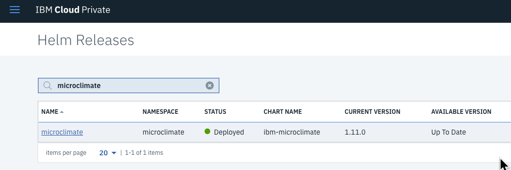

Microclimate should be already deployed and the light should be green. The latest version is 1.11.0.

Click on the blue link (i.e **microclimate**) to see more information about the application:

Browse the page to the bottom to look at the **Deployment section** :

Check that you have all 1 in all columns for the 4 deployments. 

Then go to the **bottom** of that page :

Copy the URL : https://microclimate.ipaddress.nip.io

Finally get access to the **Microclimate portal** with the following link in your browser:
(replace <ipaddress> with your icp ip address)

Accept the license agreement:

You should click on **No, not this time** and  **Done** and then you are on the main menu:

This concludes the Microclimate login. 

> Microclimate has been installed on a kubernetes cluster (on IBM Cloud Private) but it can also be installed locally along with your favorite editor.

# Task 3: Install a simple application

You’re now ready to deploy your Kubernetes application to the IBM Cloud Private environment.  In this case, the deploy command will :

Click on **New project** button:

Choose Node.JS (because we want to create a Node.js application) and type the name: **nodeone** and click **Next**

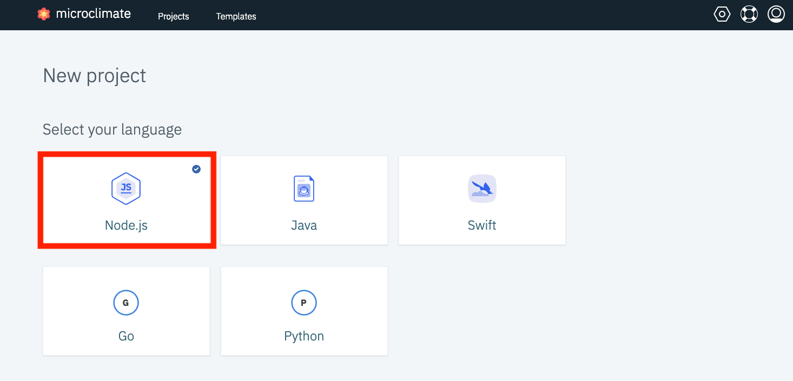

On the next menu, don't choose any service (but you can notice that we can bind a service to your new application), then click on **Create**

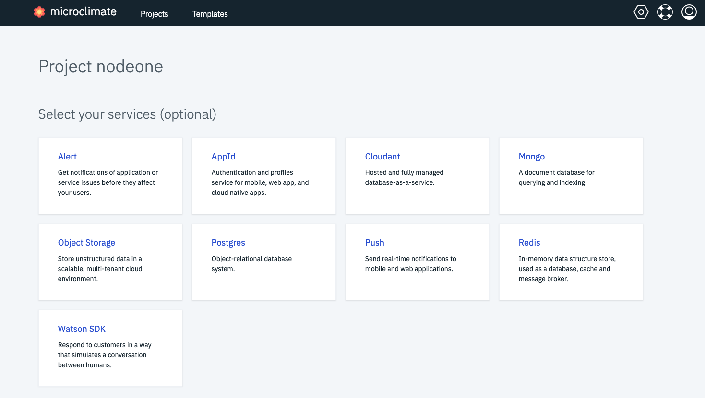

Be patient (it could take a **few minutes**). Your application should appear and the building process could still be running: 

Notice a few different information on the screen :

- Auto Build : when you change something in your code then you will rebuild automaticaly
- You can see the Application POD ID
- The Application URL is also mentioned
- The Run Load button will send some requests to your application so that you can see how it performs

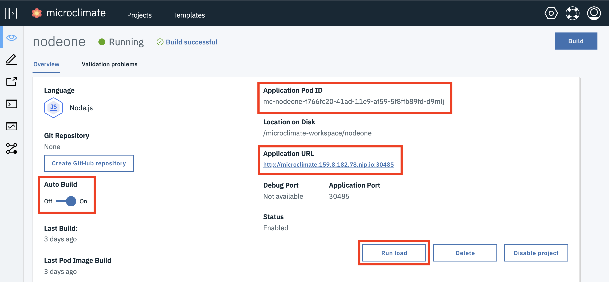

After a few minutes, the application should be running (check the green light):

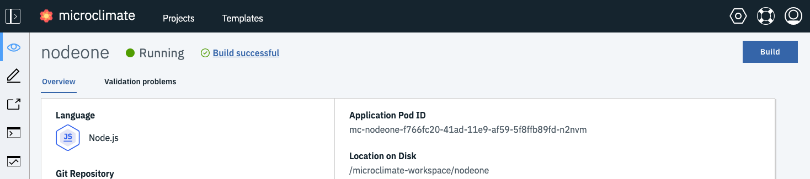

To access the application, click on the **Open App** button on the left pane:

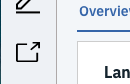

The application should appear (this is a very simple page):

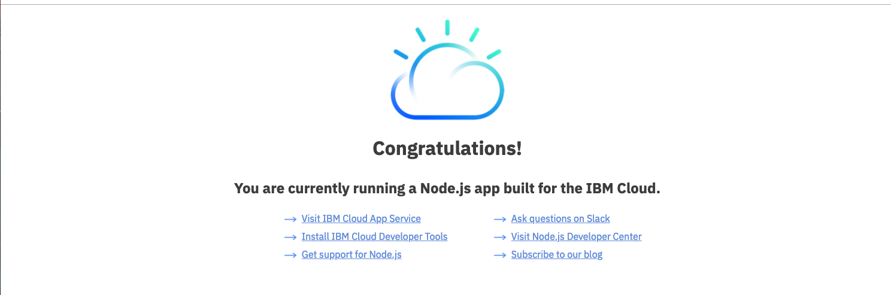

Navigate on the left pane to the **Edit** button:

At this point, the editor can be used to edit the Node.JS application.

Expand **nodeone** and you can see all predefined files (like Dockerfile, Jenkinsfile, manifest files) and you can look around the code and files necessary for your application. 

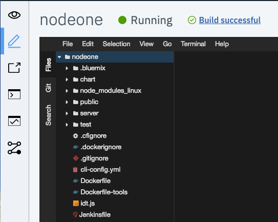

Expand **nodeone>public>index.html**

Go to the end of the index.html file and modify the **congratulation** line by adding your name :

Save (**File>Save**) and then re-build the application (because Auto Build is on, building will start automatically after saving) .

Wait until the green light(Running) to see the modification your simple application:

From the main menu of the application, click on **Run Load** and then on **Monitor** to see some metrics:

From here, Click on Projects at the top of the page:

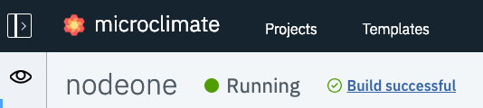

# Task 4: Import and deploy an application

To import a new application from Github, click on the **Project** button. Then choose **Import project**:

On the Import page, type `https://github.com/microclimate-demo/node` as the Git location :

Enter a name : `nodetwo` and click **Finish import and validate**

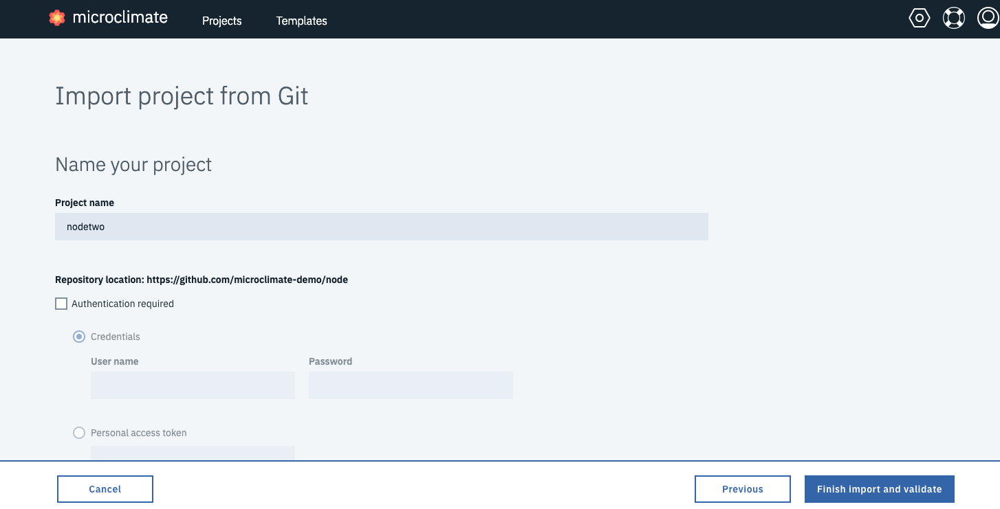

The validation will detect automatically detect the type of project and then click on **Finish Validation**:

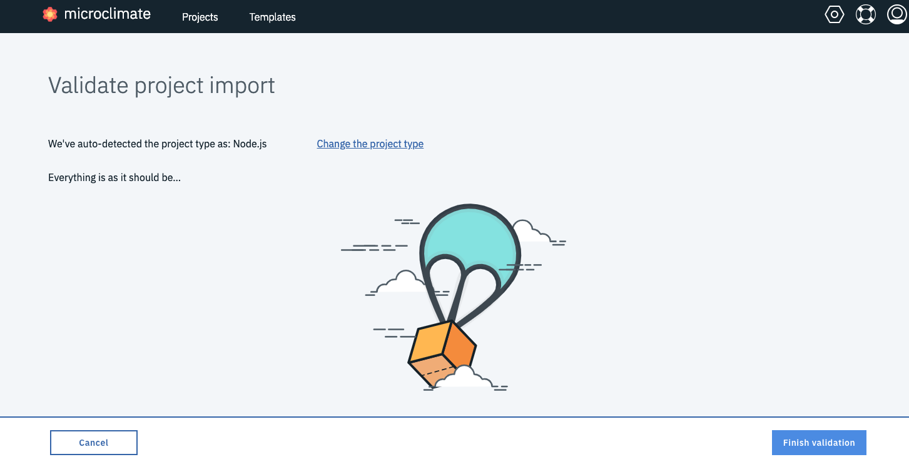

Wait until the application is running (it could take 1 minute) : 

Click on **Open App** icon to go to the application:

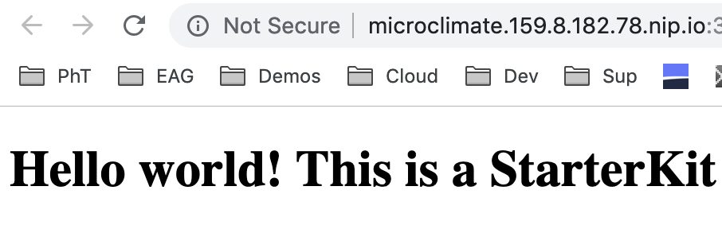

# Task 5: Using a pipeline

Microclimate has been linked with **Jenkins** and so you don't have to install a separated Jenkins instance in IBM Cloud Private. 

This part focuses on Microclimate integration with Jenkins pipeline to build and deploy your microservice application to IBM Cloud Private Kubernetes cluster. You will create a new DevOps pipeline in Microclimate, and then run the CI/CD pipeline to deploy your microservice to IBM Cloud Private.

Goto the **pipeline** icon and **create a pipeline** button:

Type a pipeline name **pipe2** and a repository to get the application (optional)

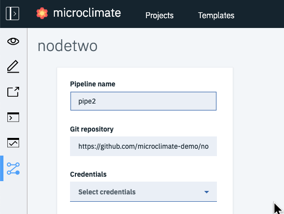  

 Click on **Create pipeline**:

Click on **Open Pipeline** to get access to Jenkins  (enter your credentials at some point if needed):

Wait until the progression ends:

You can look at the bottom left side to see there are some slave executor available :

Click on the **master** branch to see detailed information on the pipeline:

The pipeline is composed of 3 stages (Extract, Build and Notification).

After 2 or 3 minutes, you should see that the deployment is fine :

If you want to see some details about each stage : move your cursor on the green area :

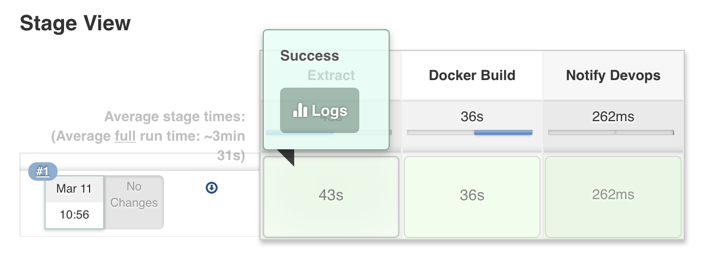

And then click on **Logs**:

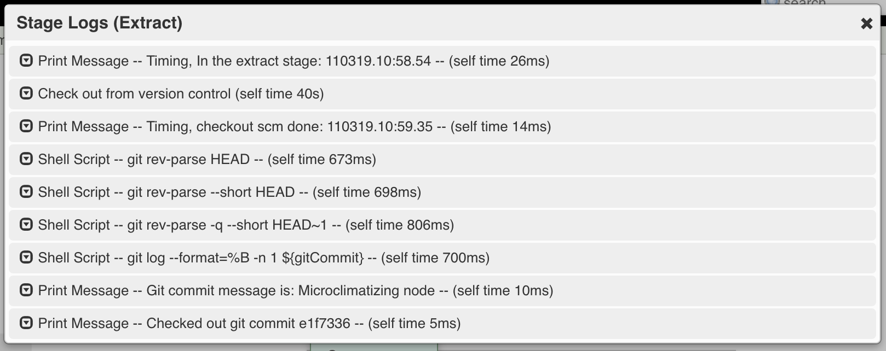

From this log, you can see all the steps done during the Extract stage.

Another possibility to get access to the logs is to click on the **#1** :

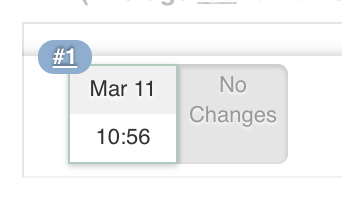

Then Click on the Console Output on the left side of the screen:

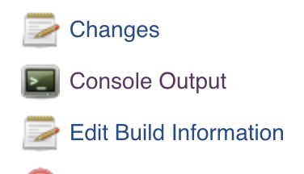

And you can scrowll the log till the end to look at the success:

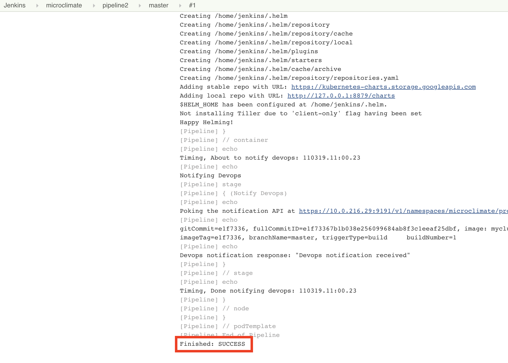

If you look thru the log, you will understand that the the Node application has been containerized using docker and then the image has pushed to the IBM Cloud Private registry (using port 8500). But the application has not been deployed yet on the cluster. 

# Task 6: Deploying with the pipeline

Microclimate provides a deployment solution. 

After you set up a pipeline to build the application and Docker image, you can now deploy applications.

Click the **Add deployment** button.

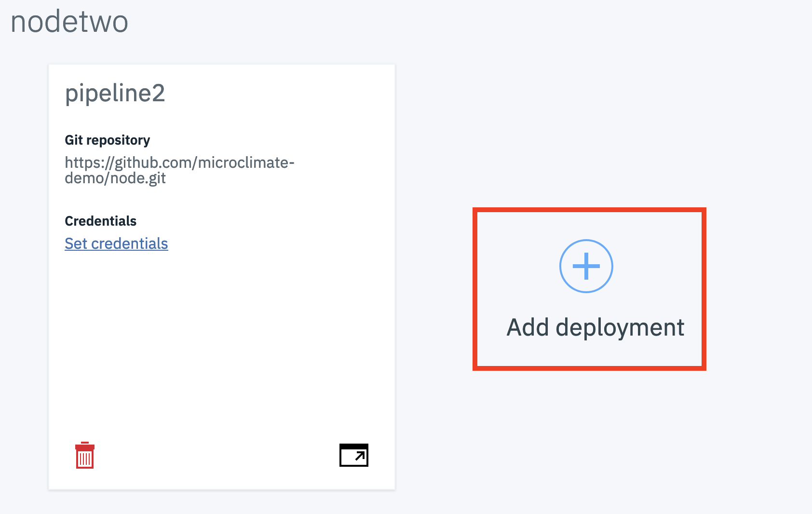

Select **Last successful build for branch** to automatically deploy the latest successful build from a specific branch. When a new build for that branch completes successfully, the deployed build is automatically upgraded with the new build.

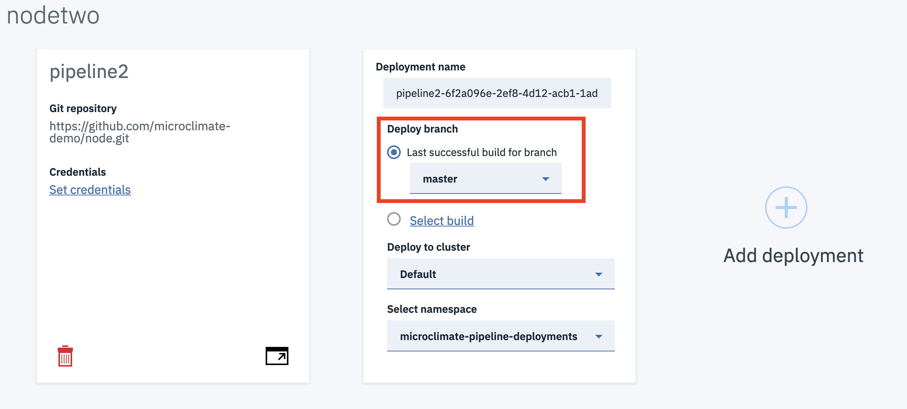

Be sure that you checked the last successful  for the **master branch**. 

Click on **Save** and after a while, you can see the blinking harmer changed to a green mark. 

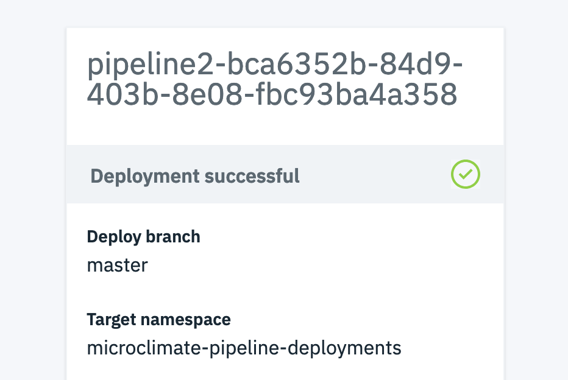

You can click on Open Pipeline to look at Jenkins if you want.

You can check on the IBM Cloud Private console : 

https://ipaddress:8443 

From the hamburger menu, **Worksloads** > **Helm Releases**

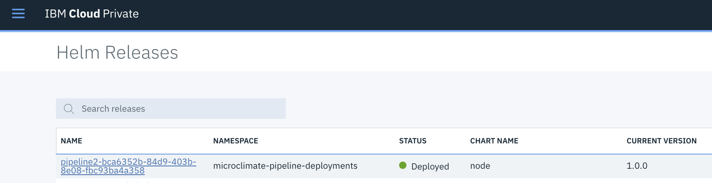

Search your deployment (pipeline2...) and click on the link.

At the end of the page, find the service section and identify the node port : 

Then use the following link to check your application :

http://ipaddress:30251

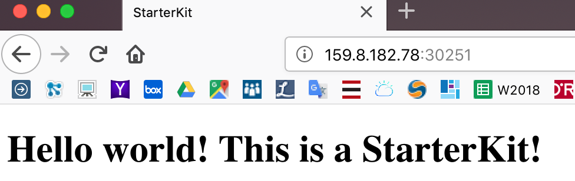

# Congratulations

You have successfully created and installed a microservice application with Microclimate.

# IBM Cloud Container Workshop