# IBM Cloud - Using the Toolchain
---

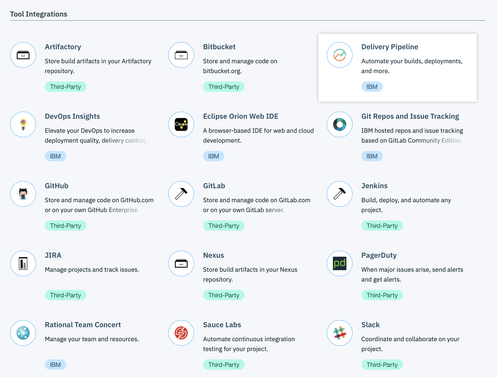
+++

# 1. Toolchain Overview

With **Continuous Delivery**, you can build, test, and deliver applications by using DevOps practices and industry-leading tools.

The Continuous Delivery service supports your DevOps workflows:

- You can create integrated DevOps open toolchains to enable tool integrations that support your development, deployment, and operations tasks.

  A toolchain is an integrated set of tools that you can use to collaboratively develop, build, deploy, test, and manage applications and make operations repeatable and easier to manage. Toolchains can include open source tools, IBM Cloud services, such as IBM® Cloud DevOps Insights, and third-party tools, such as GitHub, PagerDuty, and Slack.

  DevOps Insights is available only in the US South region.

- Deliver continuously by using automated pipelines.

  Automate builds, unit tests, deployments, and more. Build, test, and deploy in a repeatable way with minimal human intervention. Be ready to release into production at any time.

- Edit and push your code from anywhere by using the web-based IDE.

  Create, edit, run, and debug, and complete source-control tasks in GitHub. Seemlessly move from editing your code to deploying it to production.

- Collaborate with your team and manage your source code with a Git repository (repos) and issue tracker that is hosted by IBM and built on GitLab Community Edition.

  Manage Git repos through fine-grained access controls that keep code secure. Review code and enhance collaboration through merge requests. Track issues and share ideas through the issue tracker. Document projects on the wiki system.

Open **toolchains** are available in the Public and Dedicated environments on IBM® Cloud. You can create a toolchain in two ways: use a template to create a toolchain or create a toolchain from an app. As a starting point, you can use a toolchain template. Depending on the template that you use, you can create a toolchain that has a specific set of tool integrations or an empty toolchain that you can add tool integrations to.

On IBM Cloud Public, depending on the template or toolchain that you use, the toolchain might include a GitHub or Git repository (repo) that is populated with app starter code and a preconfigured delivery pipeline. When you push changes to the toolchain's repo, the delivery pipeline automatically builds and deploys the app to IBM Cloud.

On IBM Cloud Dedicated, depending on the template or toolchain that you use, the toolchain might include a GitHub or GitHub Enterprise repo that is populated with app starter code and a preconfigured delivery pipeline. When you push changes to the toolchain's GitHub or GitHub Enterprise repo, the delivery pipeline automatically builds and deploys the apps to IBM Cloud.

### Objectives 

In this lab, you create a toolchain from a template that contains a specific set of tool integrations and code to develop and deploy a sample Cloud Foundry app that is written in Node.js. The toolchain is preconfigured for continuous delivery, source control, issue tracking, and online editing. After you create the toolchain, you change the app's code and push the change to the Git Repos and Issue Tracking repository (repo). When you push changes to your repo, the delivery pipeline automatically builds and deploys the code that is in the repo.

# 2. Prerequisites 

Before you can run all the labs, you should prepare your environment to execute those labs.

Labs are running on the **IBM Cloud** (ex Bluemix). 

> if you already have a **IBM Cloud account**, you can skip this section.
>
> This account can be a lite account, a trial account or a Pay as You Go Account.

So before you can start any labs, you should have satisfied the following prerequisites :

- [ ] You should have **1 valid email** 
- [ ] Sign up to the **IBM Cloud** 

Here are some helpful steps :

### Task 1 : Sign in to IBM Cloud

If you don't have already registered to **IBM Cloud**,  
Open this link  [IBM Cloud](http://bluemix.net) or type http://bluemix.net in your favorite internet browser.

### Task 2 : Fill in the form

Specify last name, first name, corp, country, phone number and password.

> By **default**, all new people that register to IBM Cloud will have an **Lite Account** with **no time restriction**. This is not a 30 day trial account. 

Click on **Create Account** button. 

### Task 3 : Confirm your registration to IBM Cloud from your inbox

From your email application, confirm the account creation.

Log in to IBM Cloud with your credentials :

# 3. Create the Toolchain

### Task 1 : Login to IBM Cloud
Open a browser window and type http://cloud.ibm.com

### Task 2 : Access the Dashboard
Click LOG IN and then enter your login credentials on the IBM id page and click Sign in. You should see your dashboard view.

### Task 3 : Hamburger Menu
Click on **Menu** on the top left side of the screen.

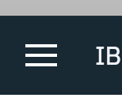

### Task 4 : DevOps page

From the menu, find and click to the **DevOps** entry. The following page appears:

Click **Create a Toolchain**

### Task 5 : Toochain Templates

From the list of toolchain templates, click on **Develop a Cloud Foundry app**

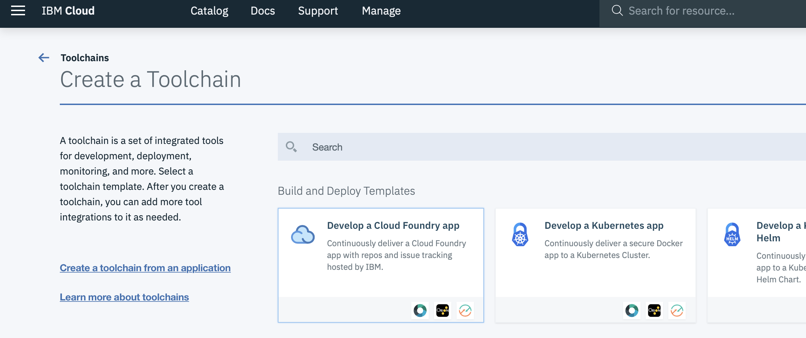

### Task 6 : Cloud Foundry App

On the creation page, review the diagram of the toolchain that you are about to create. The diagram shows each tool integration in its lifecycle phase in the toolchain.

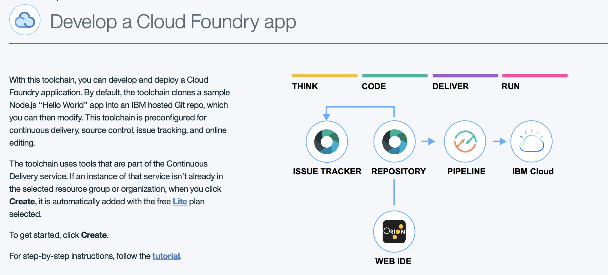

### Task 7 : Gitlab Repos

Review the default information for the toolchain settings. The toolchain's name identifies it in IBM Cloud. If you want to use a different name, region, or organization, change them.

Change the name of the toochain to **simple-toolchain-myappYYY** where YYY are your initials.

**Got at the bottom om of the page to the "Tool Integrations"**

Then in the tool Integration section, as you can see, there are 3 icons representing the **Git repos**, **Orion** and the **Pipeline**. 

On the Git repos part, we are going to clone a github repo to a new gitlab repos.

> Don't yet click create

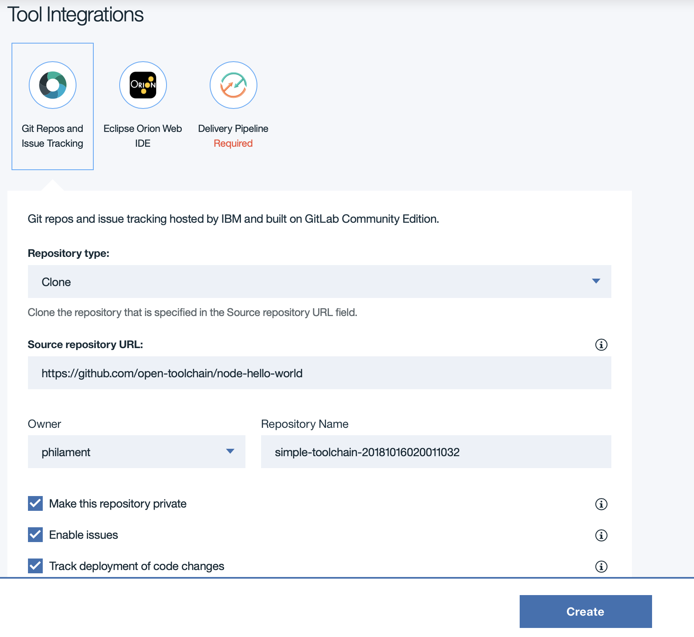

### Task 8 : Orion

Click on the Orion icon. This section explains that we are going to use an open source web IDE.

For more information about Orion, see https://orionhub.org/mixloginstatic/landing.html?redirect=https%3A%2F%2Forionhub.org%2F&key=FORMOAuthUser

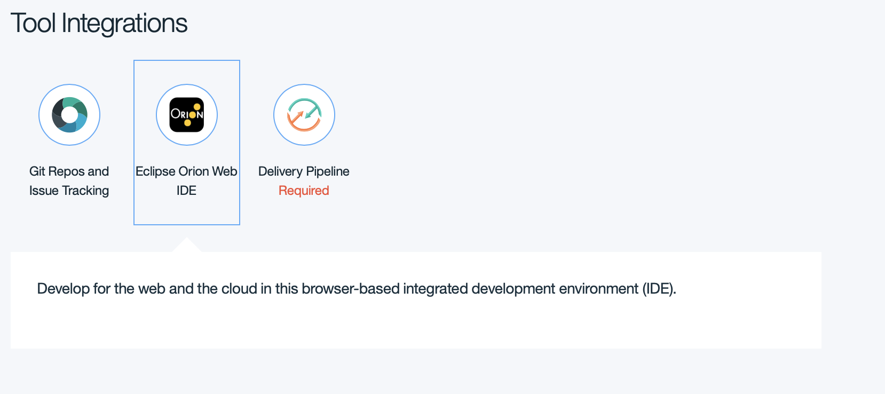

### Task 9 : Pipeline

On the pipeline section, you will change the API Key field.
Click on **create** button for a new API Key

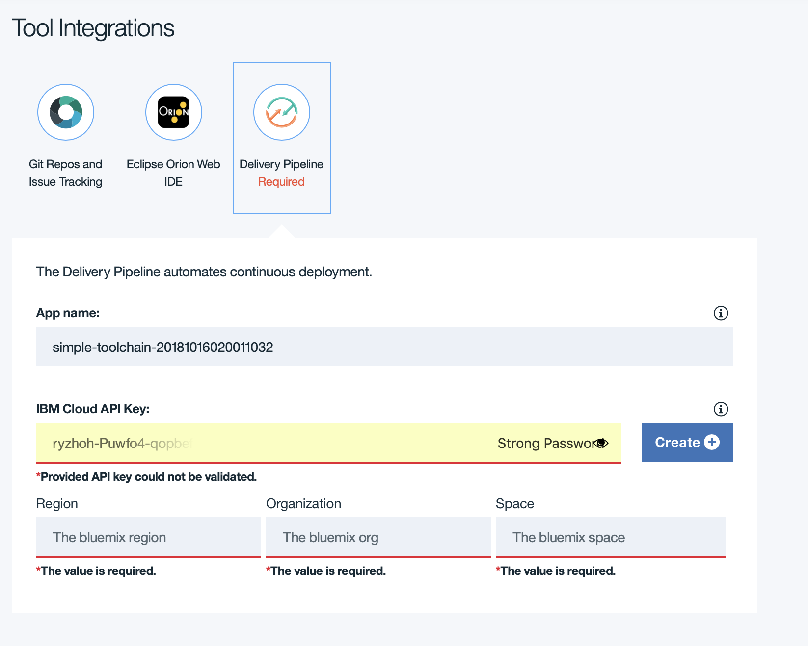

Click **Create** again on the popup to generate the API key. 

Then defines the Region (as **London**), Organisation(**your email)** and Space(**dev**).

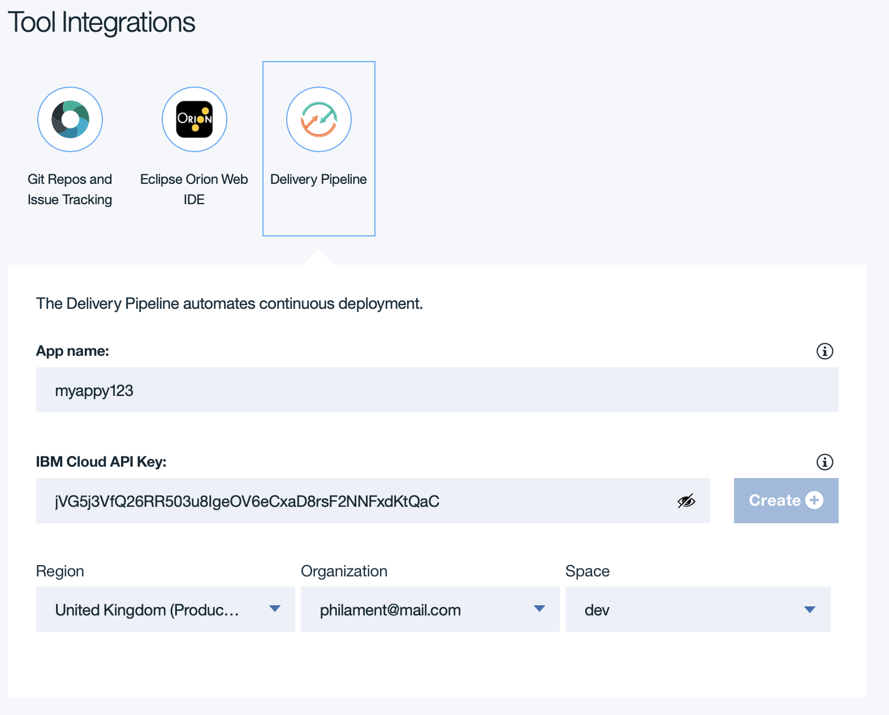

Then Click on the **Create button at the bottom** of the page.

After a short period of time, the following screen indicates that the toolchain has been created.

The toolchain is ready! You have 4 tools:

- Issues to track your problems
- GitLab to manage you code 
- Orion to edit your code
- Delivery Pipeline to manage your deployment

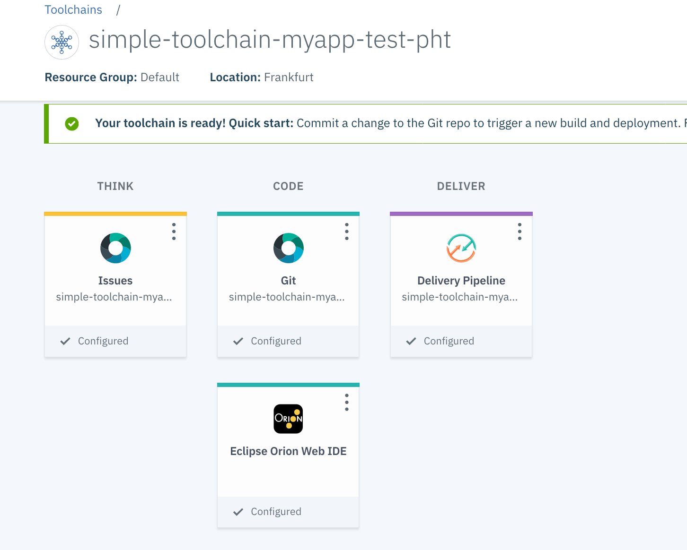

# 4. Modify the application

### Task 1 : Access Orion

In this tutorial, you will use the Eclipse **Orion** Web IDE to modify source code. When you edit in the Web IDE, your changes are saved to your cloud workspace. When you commit a change, it is saved to a Git repo on the cloud. When you push or sync a change, it is pushed to the origin Git repo (remote repo). Synching a change also saves the change from the remote repo to your Git repo and workspace on the cloud. You can also use the GitLab editor or your favorite editor to modify your app's code.

On the toolchain Overview page, click **Eclipse Orion Web IDE**. Your GitHub repo is automatically loaded in your workspace.

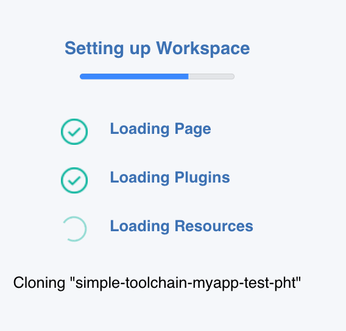

The name of the repo that is shown in the file navigator is the name that you specified for the sample GitHub Enterprise repo when you created the toolchain.

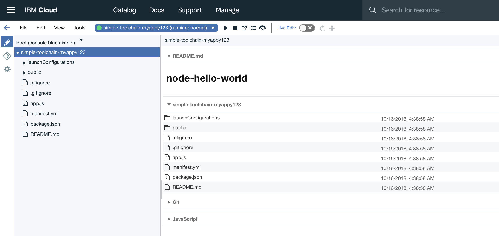

As you can see the application has been deployed and it is running (green light at the top)
To see the application, click on the following icon :

### Task 2 : Navigate into the repo

In the file navigator, expand the repo for your current toolchain and go to the **index.html** file in the public folder. Click on **index.html** to open the file.

### Task 3 : Modify the file

Change the h1 text to change the text that is displayed by the deployed app. Your changes are automatically saved.

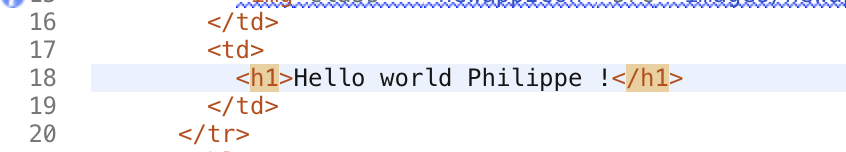

From the Eclipse Orion Web IDE menu, click the Git icon

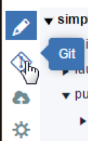

In the Working Directory Changes section, type a commit message and make sure that the changed file is selected. You can expand public/index.html to see the changes. Note that the changes are highlighted: the original content is red and the changed content is in green. 

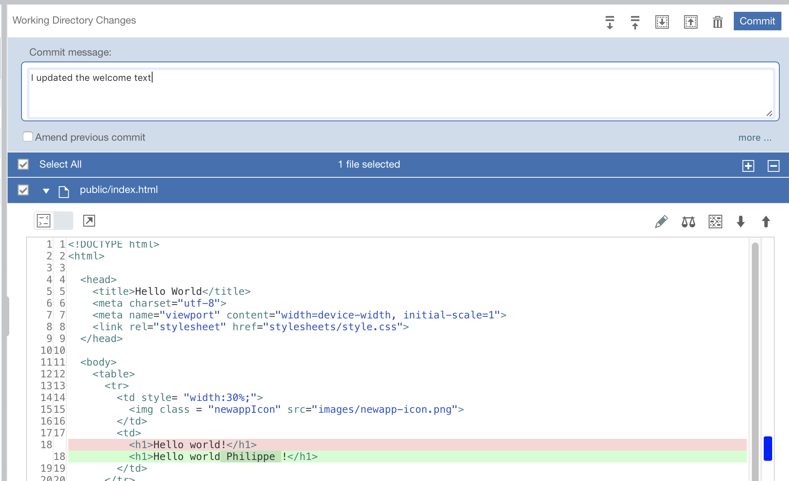

### Task 4 : Commit and Push

At the top right, click **Commit** to put the changes in the local master branch. On the left side of the page, your commit change will be added. 

To push the changes in the origin/master branch, click **Push**. The origin/master branch is used by the pipeline. Your changes are automatically built and deployed by the pipeline.

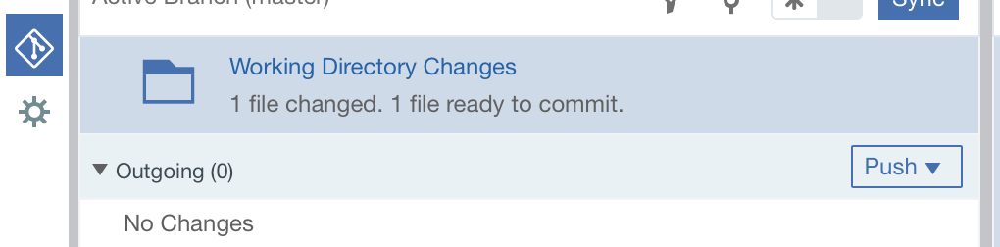

Return quickly to the toolchain Overview page by clicking the top left arrow.

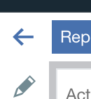

### Task 5 : Pipeline

Click **Delivery Pipeline** to watch the stages run in response to your commit.

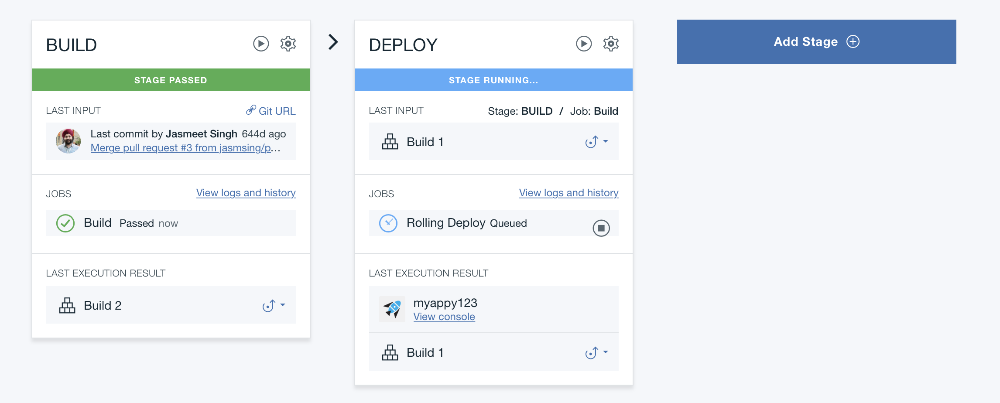

You can look at the logs during the stages by clicking on the **View Logs and History** link.

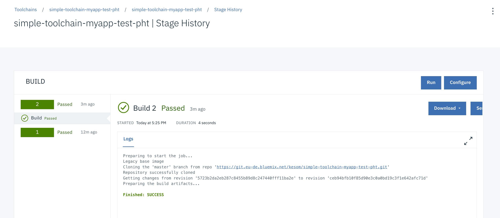

After a while, you should see your deploy stage has been passed.

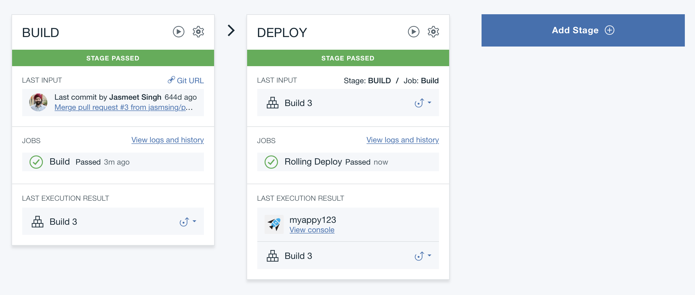

When the pipeline process is completed, go back to your app's **Overview page** on the dashboard.

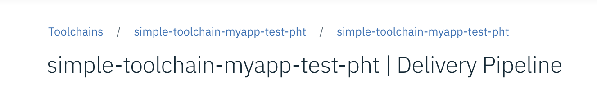

 And then click the **Visit App URL** button.

You should see your change:

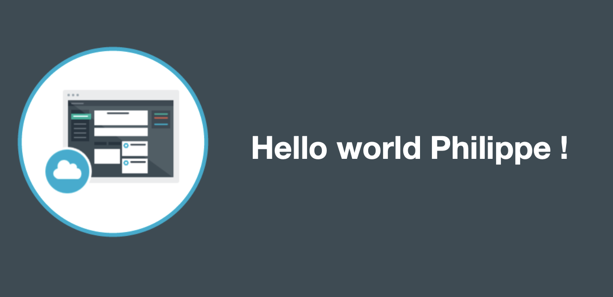

# 5. Add a stage

Go back to your Delivery Pipeline :

To add a third stage to deploy a test instance of your app, click **Add Stage**

Change the name of that stage to **Tests**

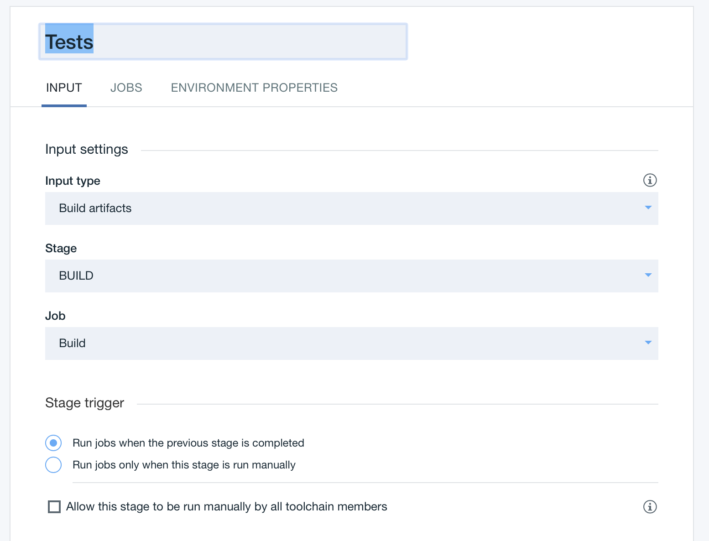

Click the **JOBS** tab and then click **Add Jobs** and **Deploy**

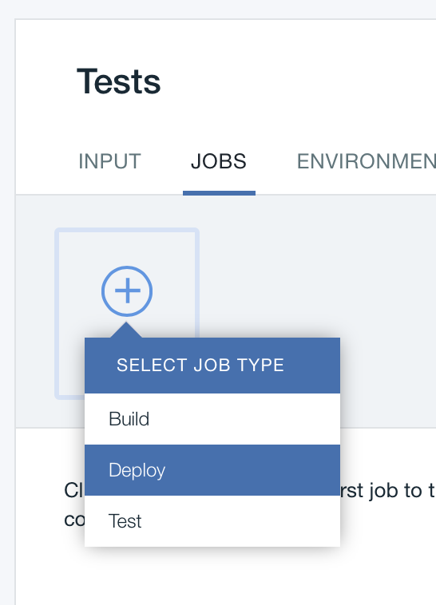

Review the values that are specified in the Organization and Space fields. Those values specify the org and space that the test instance of the app is deployed to. Make sure that a **valid org and space** are selected.

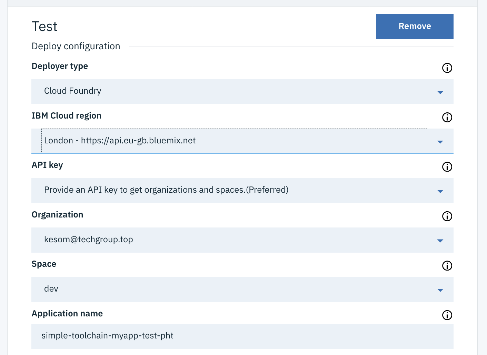

In the Deploy Script field, change the cf push command to :
`cf push "${CF_APP}"-test -n "${CF_APP}"-test`

> Note that this stage is configured to stop if the job fails.

Click **Save**.

Drag the **Tests** stage between the 2 other stages.

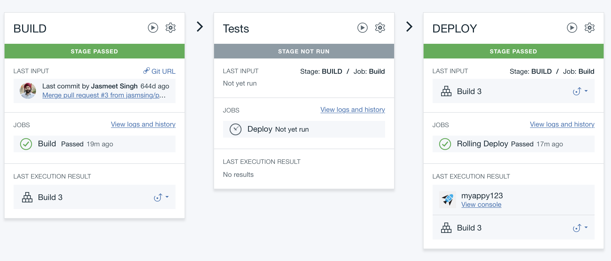

Click on the **run** button on the Build stage to restart the 3 stages :

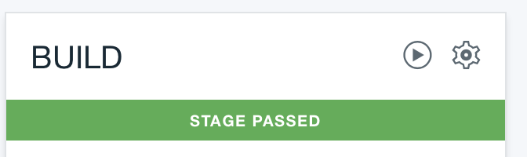

After a while :

#  Results
Successful exercise ! 

You learned how to continuously integrate and deploy an app to IBM Cloud by using a **toolchain**. You created a toolchain from a template that included a GitHub repo with a Node.js Hello World app and a delivery pipeline. You changed your app's code by using the Eclipse Orion Web IDE and added a stage to the pipeline. When you pushed the updated code, your change was built and deployed automatically.

---
# End of Lab

