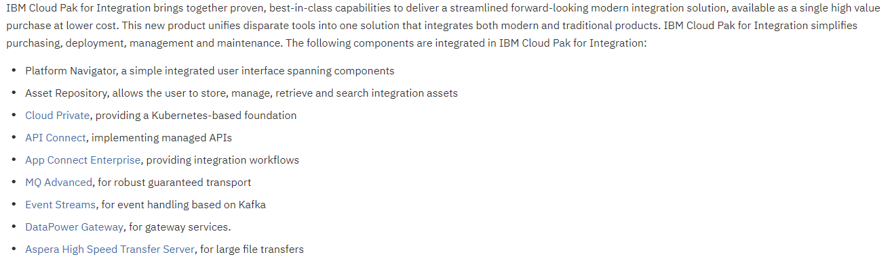

### How to manager a "Singleton" in a multi cluster environment with IBM MultiCloud Manager

Placement policy in IBM MultiCloud Manager will define the number of clusters on wich your application will be deployed. You can set that policy to 1 to ensure that only one cluster will run this app. 

In case of failure of the cluster running this app, MCM will redeploy the application on another eligible cluster (based on all placements other policies)

### How to deploy IBM Integration Bus (IIB)) in ICP

1. Check <https://github.com/ot4i/iib-helm> for IIB HELM Chart

   More details on the [IIB 10 documentation](<https://www.ibm.com/support/knowledgecenter/en/SSMKHH_10.0.0/com.ibm.etools.mft.doc/bz91410_.htm>)

2. Check the new IBM Cloud Pak for Integration as a global solution for integration : <https://www.ibm.com/cloud/cloud-pak-for-integration>

### Do you need to install ICP to manage EKS Cluster with IBM MultiCloud Manager?

You don't need to install ICP on Amazon datacenter to manage an EKS Cluster from MCM, but you need to have ICP installed somewhere in your infrastructure to have access to MCM Hub.

MCM will deploy components (*klusterlet*) in EKS to remotely manage the kubernetes clusters hosted on Amazon.

